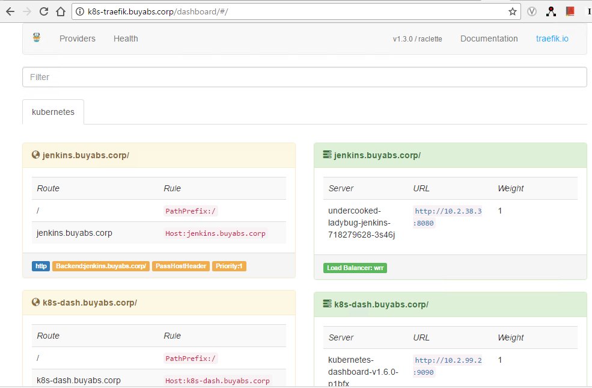
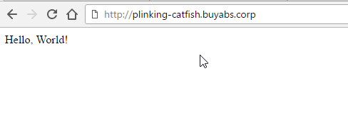
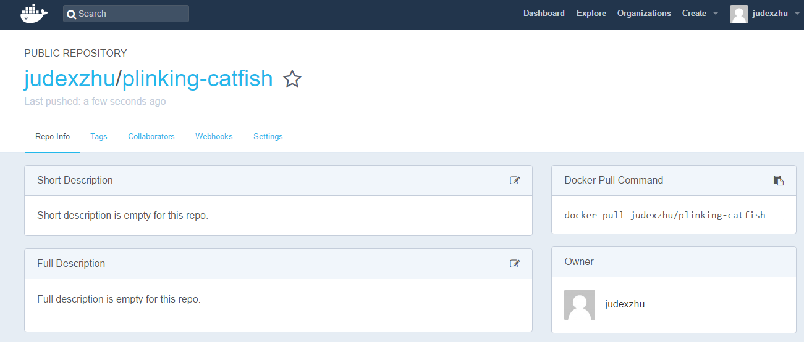
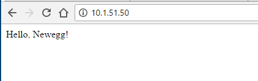
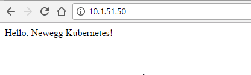
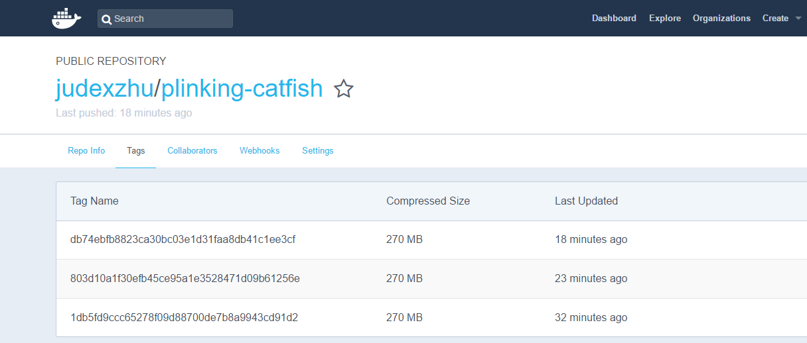

# Introducing Draft

## Draft: Streamlined Kubernetes Development


[Draft](https://github.com/Azure/draft) is a tool to help prototype microservices and expose them on a publicly available domain. This makes quickly iterating on things like webhooks or APIs quick and painless. Draft utilizes docker, [Helm](https://github.com/kubernetes/helm) and [Kubernetes](https://kubernetes.io/) Ingress Controllers to make your ‘drafts’ publicly available in a hurry. Under the hood, it generates a generic Dockerfile and helm chart for your application to get you up and running quickly. The helm chart creates an ingress resource to expose your chart at a url. You will need the following running for this walkthrough:

    - A Kubernetes Cluster with Ingress controller installed
    - A domain name you can add A or CNAME records to
    - An account at quay.io or hub.docker
    - Helm
    - Golang, python, ruby, php, node, or java applications

# Preparation

### Check kubernetes and Kubectl version 

```bash
[root@s7k8sctl ~]# kubectl version
Client Version: version.Info{Major:"1", Minor:"6", GitVersion:"v1.6.3", GitCommit:"0480917b552be33e2dba47386e51decb1a211df6", GitTreeState:"clean", BuildDate:"2017-05-10T15:48:59Z", GoVersion:"go1.7.5", Compiler:"gc", Platform:"linux/amd64"}
Server Version: version.Info{Major:"1", Minor:"6", GitVersion:"v1.6.3+coreos.0", GitCommit:"70bc0937018d89b0d529d428eed8c444d8e7729a", GitTreeState:"clean", BuildDate:"2017-05-11T18:15:57Z", GoVersion:"go1.7.5", Compiler:"gc", Platform:"linux/amd64
```

### Check Helm Version (> 2.4.x) 

```bash
[root@s7k8sctl ~]# helm version
Client: &version.Version{SemVer:"v2.4.2", GitCommit:"82d8e9498d96535cc6787a6a9194a76161d29b4c", GitTreeState:"clean"}
Server: &version.Version{SemVer:"v2.4.2", GitCommit:"82d8e9498d96535cc6787a6a9194a76161d29b4c", GitTreeState:"clean"}
```

### Check Kubernetes Ingress 



___

# Installation

## Step 1: Download Draft and Install

```bash
wget https://azuredraft.blob.core.windows.net/draft/draft-canary-linux-amd64.tar.gz

tar -zxvf draft-canary-linux-amd64.tar.gz 

mv linux-amd64/draft /usr/local/bin/
```

Check the file is in the right location

```bash
[root@s7k8sctl ~]# which draft
/usr/local/bin/draft
```
Check the options

```bash
[root@s7k8sctl ~]# draft
The application deployment tool for Kubernetes.

Usage:
  draft [command]

Available Commands:
  create      transform the local directory to be deployable to Kubernetes
  home        print the location of DRAFT_HOME
  init        initialize Draft on both client and server
  up          upload the current directory to the draft server for deployment
  version     print the client version information

Flags:
      --debug                 enable verbose output
  -h, --help                  help for draft
      --home string           location of your Draft config. Overrides $DRAFT_HOME (default "/root/.draft")
      --host string           address of Draftd. Overrides $DRAFT_HOST
      --kube-context string   name of the kubeconfig context to use

Use "draft [command] --help" for more information about a command.

```

## Step 2: Draft init

Before running draft to create our app on kubernetes , we need init it first.

I will using DockerHub as the container registry. aka, ***docker.io*** .

First, generate the AUTH_TOKEN with your DockerHub username, password and email address. 
```bash
AUTH_TOKEN=$(echo '{"username":"yourdockhubusername","password":"yourpassword","email":"youremail@address"}' | base64 --wrap=0)
```

### Draft Init

```bash
[root@s7k8sctl ~]# draft init --set registry.url=docker.io,registry.org=draft-testing,registry.authtoken=${AUTH_TOKEN},basedomain=draft.buyabs.corp
Creating /root/.draft 
Creating /root/.draft/plugins 
Creating /root/.draft/packs 
Creating pack php...
Creating pack ruby...
Creating pack python...
Creating pack golang...
Creating pack java...
Creating pack node...
$DRAFT_HOME has been configured at /root/.draft.

Draftd (the Draft server side component) has been installed into your Kubernetes Cluster.
Happy Sailing!
``` 

___

## Step 3: Check Draft

### check draft version

```bash
[root@s7k8sctl ~]# draft version
Client: &version.Version{SemVer:"canary", GitCommit:"a2f65ad9d12eb380f6dacfe54a4f321708a724de", GitTreeState:"clean"}
Server: &version.Version{SemVer:"canary", GitCommit:"a2f65ad9d12eb380f6dacfe54a4f321708a724de", GitTreeState:"dirty"
```

Draft home folder

```bash
[root@s7k8sctl ~]# draft home
/root/.draft
```

Let see what inside, 6 supported languages  and their default helm chart.

```bash
[root@s7k8sctl ~]# tree  /root/.draft/ -d 
/root/.draft/
├── packs
│   ├── golang
│   │   └── chart
│   │       └── templates
│   ├── java
│   │   └── chart
│   │       └── templates
│   ├── node
│   │   └── chart
│   │       └── templates
│   ├── php
│   │   └── chart
│   │       └── templates
│   ├── python
│   │   └── chart
│   │       └── templates
│   └── ruby
│       └── chart
│           └── templates
└── plugins

20 directories
```

One Deployment with 3 pods and One service have been created vias the draft init process.

```bash
[root@s7k8sctl ~]# kubectl get pod -n kube-system -o wide | grep draft
draftd-1366805217-jjfp6               1/1       Running   0          3h        10.2.45.2    10.1.51.61
draftd-1366805217-q8kd4               1/1       Running   0          3h        10.2.99.3    10.1.51.64
draftd-1366805217-vhhk9               1/1       Running   0          3h        10.2.72.3    10.1.51.65
[root@s7k8sctl ~]# kubectl get all -n kube-system -o wide | grep draft

po/draftd-1366805217-jjfp6               1/1       Running   0          3h        10.2.45.2    10.1.51.61
po/draftd-1366805217-q8kd4               1/1       Running   0          3h        10.2.99.3    10.1.51.64
po/draftd-1366805217-vhhk9               1/1       Running   0          3h        10.2.72.3    10.1.51.65

svc/draftd                 10.3.0.70    <none>        80/TCP          3h        app=draftd


deploy/draftd          3         3         3            3           3h        draftd         docker.io/microsoft/draft:canary       app=draft,name=draftd
rs/draftd-1366805217          3         3         3         3h        draftd                     docker.io/microsoft/draft:canary       app=draft,name=draftd,pod-template-hash=1366805217
```

Let 's play with some code.

## Step 4: Prepare Python Example

I've created a example folder and build two "Hello World" with python and golang.

Please check the files structure as below:

```bash
[root@s7k8sctl ~]# cd /draft/
[root@s7k8sctl draft]# tree .
.
└── example
    ├── golang
    │   ├── glide.yaml
    │   └── main.go
    └── python
        ├── app.py
        └── requirements.txt

3 directories, 4 files
```

### What inside the "app.py"

A Simple "Hello Word" flask app.

```python
from flask import Flask
app = Flask(__name__)

@app.route('/')
def hello_world():
    return "Hello, World!\n"

if __name__ == '__main__':
    app.run(host='0.0.0.0', port=8080)
```

### What inside the requirements.txt

python dependency package you need for your python app, which here is ***"flask"*** .

```
flask
```


## Step 5: Draft create 

```
[root@s7k8sctl draft]# cd example/python/
[root@s7k8sctl python]# draft create
--> Python app detected
--> Ready to sail
[root@s7k8sctl python]# ls
app.py  chart  Dockerfile  draft.toml  requirements.txt
```

Draft automatic detected it's a python app then create the relate Dockerfile and Helm Chart for his app.

### What's in the Dockerfile

```
[root@s7k8sctl python]# cat Dockerfile 
FROM python:onbuild
EXPOSE 8080
ENTRYPOINT ["python"]
CMD ["app.py"]
```
### You can change the APP name and Kubernetes Namespace here.

```
[root@s7k8sctl python]# cat draft.toml 
[environments]
  [environments.development]
    name = "plinking-catfish"
    namespace = "default"
    watch = true
    watch_delay = 2
```

### Default Chart value.yaml

```
[root@s7k8sctl python]# ls chart/
charts  Chart.yaml  templates  values.yaml
[root@s7k8sctl python]# cat chart/values.yaml 
# Default values for python.
# This is a YAML-formatted file.
# Declare variables to be passed into your templates.
replicaCount: 2
image:
  registry: docker.io
  org: library
  name: python
  tag: onbuild
  pullPolicy: IfNotPresent
service:
  name: python
  type: ClusterIP
  externalPort: 80
  internalPort: 8080
resources:
  limits:
    cpu: 100m
    memory: 128Mi
  requests:
    cpu: 100m
    memory: 128Mi
```

## Step 6: Draft Up

```bash
[root@s7k8sctl python]# draft up
--> Building Dockerfile
Step 1 : FROM python:onbuild
onbuild: Pulling from library/python
ef0380f84d05: Pulling fs layer
...
4b478a2c3712: Pulling fs layer
4125326b53d8: Waiting
...
887347005f96: Waiting
24c170465c65: Verifying Checksum
24c170465c65: Download complete
...
4125326b53d8: Verifying Checksum
4125326b53d8: Download complete
ef0380f84d05: Pull complete
...
4b478a2c3712: Pull complete
Digest: sha256:cc6373e713e786f5b57d60ae254e3ae777fa0175dda3ee0ac5be1cecdd5dc1db
Status: Downloaded newer image for python:onbuild
# Executing 3 build triggers...
Step 1 : COPY requirements.txt /usr/src/app/
Step 1 : RUN pip install --no-cache-dir -r requirements.txt
 ---> Running in 6cb4a79db096
Collecting flask (from -r requirements.txt (line 1))
  Downloading Flask-0.12.2-py2.py3-none-any.whl (83kB)
Collecting Jinja2>=2.4 (from flask->-r requirements.txt (line 1))
  Downloading Jinja2-2.9.6-py2.py3-none-any.whl (340kB)
Collecting itsdangerous>=0.21 (from flask->-r requirements.txt (line 1))
  Downloading itsdangerous-0.24.tar.gz (46kB)
Collecting Werkzeug>=0.7 (from flask->-r requirements.txt (line 1))
  Downloading Werkzeug-0.12.2-py2.py3-none-any.whl (312kB)
Collecting click>=2.0 (from flask->-r requirements.txt (line 1))
  Downloading click-6.7-py2.py3-none-any.whl (71kB)
Collecting MarkupSafe>=0.23 (from Jinja2>=2.4->flask->-r requirements.txt (line 1))
  Downloading MarkupSafe-1.0.tar.gz
Installing collected packages: MarkupSafe, Jinja2, itsdangerous, Werkzeug, click, flask
  Running setup.py install for MarkupSafe: started
    Running setup.py install for MarkupSafe: finished with status 'done'
  Running setup.py install for itsdangerous: started
    Running setup.py install for itsdangerous: finished with status 'done'
Successfully installed Jinja2-2.9.6 MarkupSafe-1.0 Werkzeug-0.12.2 click-6.7 flask-0.12.2 itsdangerous-0.24
Step 1 : COPY . /usr/src/app
 ---> 9b0365f8b42c
Step 2 : EXPOSE 8080
 ---> Running in 07be88eebe2c
 ---> 74df397b0ce4
Step 3 : ENTRYPOINT python
 ---> Running in 8d0b41441530
 ---> d074920ffadb
Step 4 : CMD app.py
 ---> Running in 1eb16e12de72
 ---> 3c29e61af98b
Successfully built 3c29e61af98b
--> Pushing docker.io/judexzhu/plinking-catfish:1db5fd9ccc65278f09d88700de7b8a9943cd91d2
The push refers to a repository [docker.io/judexzhu/plinking-catfish]
e635143b5189: Preparing
460032796d2e: Preparing
...
4902b007e6a7: Preparing
007ab444b234: Preparing
7cd56c69527f: Waiting
...
007ab444b234: Waiting
e95f4a878d0c: Mounted from library/python
...
201187968504: Mounted from library/python
2f7bd63a5db0: Pushed
e635143b5189: Pushed
4902b007e6a7: Mounted from library/python
...
007ab444b234: Mounted from library/python
460032796d2e: Pushed
1db5fd9ccc65278f09d88700de7b8a9943cd91d2: digest: sha256:1281048e94802295b4a411d72dab411f6d326ffe176ed463222b26c57e58bdcd size: 2840
--> Deploying to Kubernetes
    Release "plinking-catfish" does not exist. Installing it now.
--> Status: DEPLOYED
--> Notes:
     
  http://plinking-catfish.draft.buyabs.corp to access your application

Watching local files for changes...
```

and Our "Hello World" flask app is running now.

## Step 6: Check



and we will found it automatic create a docker image with the name we set inside the draft.toml.




## Step 7: Upgrade 

Change the content of the app.py, and it will automatic recreate the docker image, upload to dockerhub and upgrade the kubernetes deployment

Hello, Newegg!



Hello, Newegg kubernetes!



and Also We can check the dockerhub and see different tags of the docker images has been uploaded.




## Clean UP

Since draft deploys projects via helm, you can just run `helm delete --purge draft` to delete draft from the server. You can also invoke the same command for the applications you deployed to the cluster.

___

## Conclusion 

Draft is the first production after the Deis join the Microsoft Azure Team. Still it has a lot of issue and problem and not ready for the production, still it worth to left an eye on it.