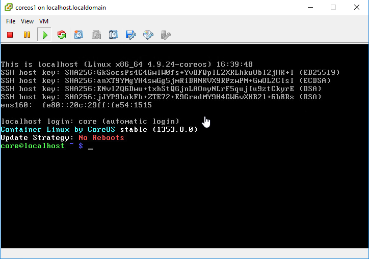

## Kubernetes Tutorials (1)

# Install CoreOS with ISO

## What is CoreOS Container Linux and Why
A lightweight Linux operating system designed for clustered deployments providing automation, security, and scalability for most critical applications.


So basically except some core part of the Linux distribution, like the **kernel**, **systemd**, **sshd**, **docker**, **rkt** those which will be pre-installed in the CoreOS container linux, the others app all will be deployed as a container , even **ping**.

- First Container optimized OS.
- Linux based and based on concepts from ChromeOS
- OS is Security focused.
- Auto Update OS with A/B partition
- OS is Open Source. Along with OS, CoreOS has following components:
  - Systemd as Init system
  - Etcd as distributed database
  - Flannel for Container networking 
  - Docker, Rkt for Containers
- CoreOS integrates well with Kubernetes
___
## Environment Preparation 

### Environment

        DNS:            10.10.116.202
        NTP:            10.1.37.52
        centos1 ip:     10.1.51.11/25
        coreos1 ip:     10.1.51.12/25
        GATEWAY:        10.1.51.1        


|       ServerName     |    IP ADDRESS    |     VCPU      |     MEMORY(GB)      |     DISK(GB)      |
|:--------------------:|:----------------:|:-------------:|:-------------------:|:-----------------:|
|   CENTOS1       |   10.1.51.11 |      2        |       4           |        20        |
|   COREOS1       |   10.1.51.12 |      2        |        4           |        20        |


> Note: If you don't know how to install CentOS 7. Here is a [Step by Step](https://www.howtoforge.com/tutorial/centos-7-minimal-server/) guild.

---
# Step 1: Centos1 configuration

### Reference - [CoreOS Installing to disk](https://coreos.com/os/docs/latest/installing-to-disk.html)


## 1: Login to Centos1

```bash
[root@centos1 ~]#
```

## 2: Test connection

root@centos1 ~ $ ping www.newegg.com
PING www.newegg.com (204.14.213.160) 56(84) bytes of data.
64 bytes from 204.14.213.160: icmp_seq=1 ttl=245 time=70.7 ms
64 bytes from 204.14.213.160: icmp_seq=2 ttl=245 time=70.9 ms


## 3: Install Disable Selinux

[root@centos1 ~]# vi /etc/selinux/config

Change SELINUX=disabled


## 4: Generating a pair of Public/Private SSH Access Keys

Make a new folder to save the Public/Private keys.

```bash
[root@centos1 ~]# mkdir /root/CoreOS
```

Using below command to generate the ssh key.

> Replace `{EmailAddress}` with your own email address, e.g., `Jude.X.Zhu@newegg.com`

```bash
ssh-keygen -t rsa -b 2048 -C "{EmailAddress}"
```
Set the passphrase to double secure the ssh access.  

```bash
[root@centos1 ~]# ssh-keygen -t rsa -b 2048 -C "jude.x.zhu@newegg.com"
Generating public/private rsa key pair.
Enter file in which to save the key (/root/.ssh/id_rsa): /root/CoreOS/coreos
Enter passphrase (empty for no passphrase): 
Enter same passphrase again: 
Your identification has been saved in /root/CoreOS/coreos.
Your public key has been saved in /root/CoreOS/coreos.pub.
The key fingerprint is:
c4:a1:b6:0b:6e:7b:43:5e:bc:00:32:c7:20:ab:fc:06 jude.x.zhu@newegg.com
The key's randomart image is:
+--[ RSA 2048]----+
|        .        |
|. .    o .       |
| o o  o o        |
|. o +. o         |
|o  +....S        |
|.E . .o.o        |
|  o oo.o .       |
|   + .+ .        |
|  . .. .         |
+-----------------+
[root@centos1 ~]#
```

Confirm the public/private rsa key pair.

```bash
[root@centos1 ~]# ls -al /root/CoreOS/
total 8
drwxr-xr-x. 2 root root   38 Jun 15 08:42 .
dr-xr-x---. 3 root root  149 Jun 15 08:40 ..
-rw-------. 1 root root 1766 Jun 15 08:42 coreos
-rw-r--r--. 1 root root  403 Jun 15 08:42 coreos.pub
```

```bash
[root@centos1 ~]# cat /root/CoreOS/coreos.pub 
ssh-rsa AAAAB3NzaC1yc2EAAAADAQABAAABAQDV/DpQ8veDFrOBCZcCzVnOJhLunhOTlYctErXZ0kXXGK42D6TOD26plQK8UTwEko/Az89KhUZEHKImJmiSfmuPbUr0LlIwL7c0z0mHmXxZXUNBz4oDraz5YplXG27YJhNgqomL1l8vFcp4KZRnnHCd47K7s3ISAnRvlKD59nEB3iLFN25iLgqE015RkzVoOOcQn+dxf535jpsWqSNj4IzLQTQP0+RAa91f25cAef3nP9nV8BQFeQsrNhVWeLqcxsugsrBdqnd4MpPooHKJ7FmA4uqn/AHXZLeRK6l+CdLXlaCeOnVYWrzRkPbW+MnpsOBQSdM7djdwpWp9cJeVAvTL jude.x.zhu@newegg.com
[root@centos1 ~]#
```

## 5: Create Cloud-init Config File


### Cloud-init Config File

[Cloud config init file examples](http://cloudinit.readthedocs.io/en/latest/topics/examples.html)

```bash
vi /root/CoreOS/cloud-config.yaml
```

Replace the variables with your own environment values.

    {CoreOS-Hostname}:      Server Hostname. e.g., coreos1
    {Public-Key-Content}:   The content of your public key which was generated in previous step.
    {NIC-Name}:             Network Card Name. e.g., ens160
    {DNS}:                  DNS IP ADDRESS. e.g, 10.10.116.202
    {IPADDR}:               IP ADDRESS. e.g., 10.1.51.12/25
    {TimeZone}:             TimeZone, using "timedatectl list-timezones" on CentOS 7 to list and find your own timezone value. e.g., America/Los_Angeles
    {NTP}:                  NTP Server Addresses, separate with space. e.g., 10.1.37.52


```yaml
#cloud-config
#
##hostname
hostname: "{CoreOS-Hostname}"

# include one or more SSH public keys
ssh_authorized_keys:
  - {Public-Key-Content}
# Network
coreos:
  units:
    - name: 00-internal.network
      runtime: true
      content: |
        [Match]
        Name={NIC-Name}

        [Network]
        DNS={DNS}
        Address={IPADDR}
        Gateway={GATEWAY}

    - name: settimezone.service
      command: start
      content: |
        [Unit]
        Description=Set the time zone

        [Service]
        ExecStart=/usr/bin/timedatectl set-timezone {TimeZone}
        RemainAfterExit=yes
        Type=oneshot
    - name: update-engine.service
      mask: true
    - name: locksmithd.service
      mask: true
write_files:
  - path: /etc/systemd/timesyncd.conf
    content: |
      [Time]
      NTP={NTP}
```
___
Here is an example with values;

```yaml
#cloud-config
#
##hostname
hostname: "coreos1"

# include one or more SSH public keys
ssh_authorized_keys:
  - ssh-rsa AAAAB3NzaC1yc2EAAAADAQABAAABAQDV/DpQ8veDFrOBCZcCzVnOJhLunhOTlYctErXZ0kXXGK42D6TOD26plQK8UTwEko/Az89KhUZEHKImJmiSfmuPbUr0LlIwL7c0z0mHmXxZXUNBz4oDraz5YplXG27YJhNgqomL1l8vFcp4KZRnnHCd47K7s3ISAnRvlKD59nEB3iLFN25iLgqE015RkzVoOOcQn+dxf535jpsWqSNj4IzLQTQP0+RAa91f25cAef3nP9nV8BQFeQsrNhVWeLqcxsugsrBdqnd4MpPooHKJ7FmA4uqn/AHXZLeRK6l+CdLXlaCeOnVYWrzRkPbW+MnpsOBQSdM7djdwpWp9cJeVAvTL jude.x.zhu@newegg.com
# Network
coreos:
  units:
    - name: 00-internal.network
      runtime: true
      content: |
        [Match]
        Name=ens160

        [Network]
        DNS=10.10.116.202
        Address=10.1.51.12/25
        Gateway=10.1.51.1

    - name: settimezone.service
      command: start
      content: |
        [Unit]
        Description=Set the time zone

        [Service]
        ExecStart=/usr/bin/timedatectl set-timezone America/Los_Angeles
        RemainAfterExit=yes
        Type=oneshot
    - name: update-engine.service
      mask: true
    - name: locksmithd.service
      mask: true
write_files:
  - path: /etc/systemd/timesyncd.conf
    content: |
      [Time]
      NTP=10.1.37.52
```


## 6: Start httpd service

Install and start the Apache httpd service.

```bash
yum install -y httpd

systemctl enable httpd --now
``` 

Allow httpd service port through firewall.

```bash
firewall-cmd --permanent --add-service=http
firewall-cmd --reload
```

Copy /root/CoreOS to httpd root folder.

```bash
cp -r /root/CoreOS /var/www/html/
```

Confirm

Use 'Curl' to check the Link

```
curl http://10.1.51.11/CoreOS/cloud-config.yaml
```

> Replace `10.1.51.11` with your own IP address.


# Step 2: Coreos1 installation

## 1: Download CoreOS ISO into your local PC

Download the CoreOS ISO file from [Here](https://stable.release.core-os.net/amd64-usr/current/coreos_production_iso_image.iso).


## 2: Boot coreos1 from CoreOS ISO

We've done the part of the centos1, let's 



## 3: Set IP address, Gateway and DNS

Use `ip a` command to list the nic card,

Set the ip, gateway for coreos1

```bash
sudo ifconfig ens160 10.1.51.12 netmask 255.255.255.128
sudo route add default gw 10.1.51.1
```

> Replace `10.1.51.12` and `10.1.51.1` with your own values.

You can use `ip a` and `ping` to check the connectivity of your `coreos1`.

Add DNS

```
echo 'nameserver 8.8.8.8' | sudo tee --append /etc/resolv.conf
```
## 4: Download cloud-config.yaml

Download cloud-config.yaml to your coreos1.

```bash
wget http://10.1.51.11/CoreOS/cloud-config.yaml
```

Modify the ***variables*** inside the `cloud-config.yaml` if you need.

## 5: Install CoreOS to the disk

Run

```bash
coreos-install -C stable -d /dev/sda -c cloud-config.yaml
``` 

After you see `Success! CoreOS stable XXXX.X.X is installed on /dev/sda`.

`reboot` the server.

# Step 3: Verify

Go back to centos1

```bash
[root@centos1 ~]# 
[root@centos1 ~]# ssh -i /root/CoreOS/coreos core@10.1.51.12
The authenticity of host '10.1.51.12 (10.1.51.12)' can't be established.
ECDSA key fingerprint is b9:53:6b:c4:77:8b:e1:9f:8d:c1:fc:48:fe:1c:0e:af.
Are you sure you want to continue connecting (yes/no)? yes
Warning: Permanently added '10.1.51.12' (ECDSA) to the list of known hosts.
Enter passphrase for key '/root/CoreOS/coreos': 
Container Linux by CoreOS stable (1353.8.0)
core@coreos1 ~ $            
core@coreos1 ~ $ 
core@coreos1 ~ $ 
core@coreos1 ~ $ 
core@coreos1 ~ $ 
```

## Done
