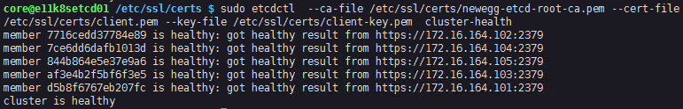

## Kubernetes Tutorials (3)

# How to install ETCD on CoreOS 

## etcd v2 or v3

Since Kubernetes 1.6.0, it requires the etcd v3 . Although I used kubernetes 1.5.1 with etcd v2, but in the future, we will only talk about etcd v3 version.

## Which way to install 

There are several ways to install etcd services in the CoreOS linux, *for example:*

    - etcd binary
    - docker
    - etcd.member 

For etcd binary only support etcd v2 right now. We will use etcd.member services or build our own etcd docker image. Using the etcd.member might be the easiest way to go.

## Environment

### Servers List

As we discussed at last tutorial , we will have 5 nodes , so the failure tolerance would be 2.  

|       ServerName     |    IP ADDRESS    |     VCPU      |     MEMORY(GB)      |     DISK(GB)      |
|:--------------------:|:----------------:|:-------------:|:-------------------:|:-----------------:|
|   E11K8SETCD01       |   172.16.164.101 |      8        |        16           |        100        |
|   E11K8SETCD01       |   172.16.164.101 |      8        |        16           |        100        |
|   E11K8SETCD01       |   172.16.164.101 |      8        |        16           |        100        |
|   E11K8SETCD01       |   172.16.164.101 |      8        |        16           |        100        |
|   E11K8SETCD01       |   172.16.164.101 |      8        |        16           |        100        |

Also we prepare the certificates for etcd security by using the cfssl tool. (*If only running etcd cluster for evaluation purpose, you can skip the certificate part and using http, but for the production we strongly recommend adding TLS security to your etcd cluster.* )


___

# Step by Step: Install etcd.member

    - Step 1: Copy the certs files to the server
    - Step 2: Generate override conf.d file for etcd-member-service
    - Step 3: Greate the etcd-member.service.d override.conf file
    - Step 4: Check service-file-override status
    - Step 5: Start etcd-member.service
    - Step 6: Check the log
    - Step 7: Check the Cluster Health

## Step 1: Copy the certs files to the local server 

Repeat below steps on every etcd numbers. (*client.pem and client-key.pem are only download for testing, You can skip download them if you want.*)

```bash
cd /etc/ssl/certs

sudo curl -O http://172.16.164.99/cfssl/newegg-etcd-root-ca.pem

sudo curl -O http://172.16.164.99/cfssl/e11k8setcd01-peer.pem
sudo curl -O http://172.16.164.99/cfssl/e11k8setcd01-peer-key.pem

sudo curl -O http://172.16.164.99/cfssl/e11k8setcd01.pem
sudo curl -O http://172.16.164.99/cfssl/e11k8setcd01-key.pem

sudo curl -O http://172.16.164.99/cfssl/client.pem
sudo curl -O http://172.16.164.99/cfssl/client-key.pem
``` 

## Step 2: Generate override conf.d file for etcd-member-service

```bash
cat > /tmp/override-my-etcd-1.conf <<EOF
[Service]
Environment="ETCD_IMAGE_TAG=v3.1.5"
Environment="ETCD_DATA_DIR=/var/lib/etcd"
Environment="ETCD_SSL_DIR=/etc/ssl/certs"
Environment="ETCD_OPTS=--name e11k8setcd01 \
    --listen-client-urls https://172.16.164.101:2379,http://127.0.0.1:2379 \
    --advertise-client-urls https://172.16.164.101:2379 \
    --listen-peer-urls https://172.16.164.101:2380 \
    --initial-advertise-peer-urls https://172.16.164.101:2380 \
    --initial-cluster e11k8setcd01=https://172.16.164.101:2380,e11k8setcd02=https://172.16.164.102:2380,e11k8setcd03=https://172.16.164.103:2380,e11k8setcd04=https://172.16.164.104:2380,e11k8setcd05=https://172.16.164.105:2380 \
    --initial-cluster-token newegg-etcd-token \
    --initial-cluster-state new \
    --client-cert-auth \
    --trusted-ca-file /etc/ssl/certs/newegg-etcd-root-ca.pem \
    --cert-file /etc/ssl/certs/e11k8setcd01.pem \
    --key-file /etc/ssl/certs/e11k8setcd01-key.pem \
    --peer-client-cert-auth \
    --peer-trusted-ca-file /etc/ssl/certs/newegg-etcd-root-ca.pem \
    --peer-cert-file /etc/ssl/certs/e11k8setcd01-peer.pem \
    --peer-key-file /etc/ssl/certs/e11k8setcd01-peer-key.pem "
EOF
``` 
---
### Flags Configurations

[Reference]()

```
Environment="ETCD_IMAGE_TAG=v3.1.5"
```

The etcd image version tag from "*quay.io/coreos/etcd*", the newest is *v3.2.0*, you can use the newest one if you build a new cluster, but as long as there is no significant change between the main version and it runs well, I won't consider to upgrade the health running cluster to the newest version frequently.

```
Environment="ETCD_OPTS=--name e11k8setcd01 \
```

>`- name` the human-readable name for the etcd member. Use the hostname for the server would be just fine. 


```
    --listen-client-urls https://172.16.164.101:2379,http://127.0.0.1:2379 \
    --advertise-client-urls https://172.16.164.101:2379 \
```

>`listen-urls` specifies the local addresses etcd server binds to for accepting incoming connections. To listen on a port for all interfaces, specify `0.0.0.0` as the listen IP address.

>`advertise-urls` specifies the addresses etcd clients or other etcd members should use to contact the etcd server. The advertise addresses must be reachable from the remote machines. Do not advertise addresses like `localhost` or `0.0.0.0` for a production setup since these addresses are unreachable from remote machines.

```
    --listen-peer-urls https://172.16.164.101:2380 \
```

>List of URLs to listen on for peer traffic. If an IP address is given as well as a port, etcd will listen on the given port and interface.

```
    --initial-advertise-peer-urls https://172.16.164.101:2380 \
```

>List of this member's peer URLs to advertise to the rest of the cluster. These addresses are used for communicating etcd data around the cluster. At least one must be routable to all cluster members. These URLs can contain domain names.

```
    --initial-cluster e11k8setcd01=https://172.16.164.101:2380,e11k8setcd02=https://172.16.164.102:2380,e11k8setcd03=https://172.16.164.103:2380,e11k8setcd04=https://172.16.164.104:2380,e11k8setcd05=https://172.16.164.105:2380 \
```

>Initial cluster configuration for bootstrapping. list all your `--listen-peer-urls` here and separate with "*,*". 

```
   --initial-cluster-token newegg-etcd-token \
```

>Initial cluster token for the etcd cluster during bootstrap. Just strings.

```
    --initial-cluster-state new \
```

>Initial cluster state ("new" or "existing"). Set to `new` for all members present during initial static or DNS bootstrapping. If this option is set to `existing`, etcd will attempt to join the existing cluster. If the wrong value is set, etcd will attempt to start but fail safely.

```
    --client-cert-auth \
    --trusted-ca-file /etc/ssl/certs/newegg-etcd-root-ca.pem \
    --cert-file /etc/ssl/certs/e11k8setcd01.pem \
    --key-file /etc/ssl/certs/e11k8setcd01-key.pem \
```

>Enable client cert authentication. Put your path to the client server TLS trusted CA key file and server type TLS Certs/Key files path here.  

```
    --peer-client-cert-auth \
    --peer-trusted-ca-file /etc/ssl/certs/newegg-etcd-root-ca.pem \
    --peer-cert-file /etc/ssl/certs/e11k8setcd01-peer.pem \
    --peer-key-file /etc/ssl/certs/e11k8setcd01-peer-key.pem "
```

>Enable peer client cert authentication. Put your path to the peer server TLS trusted CA file and peer type TLS Certs/Key files path here.

---

## Step 3: Greate the etcd-member.service.d override.conf file

```bash
sudo mkdir -p /etc/systemd/system/etcd-member.service.d
sudo mv /tmp/override-my-etcd-1.conf /etc/systemd/system/etcd-member.service.d/override.conf
```

## Step 4: Check service-file-override status

```bash
sudo systemd-delta --type=extended
```

## Step 5: Start etcd-member.service

Systemd daemon reload

```bash
sudo systemctl daemon-reload
```

Enable and Start etcd-member.service

```bash
sudo systemctl enable etcd-member.service
sudo systemctl start etcd-member.service
```

>or

```bash
sudo systemctl enable etcd-member.service --now
```


[Reference: Using systemd drop-in units](https://coreos.com/os/docs/latest/using-systemd-drop-in-units.html)

## Step 6: Check the log

```bash
sudo journalctl -b -u etcd-member -f
```

## Step 7: Check the Cluster Health

```bash
sudo etcdctl  --ca-file /etc/ssl/certs/newegg-etcd-root-ca.pem --cert-file /etc/ssl/certs/client.pem --key-file /etc/ssl/certs/client-key.pem  cluster-health
```



