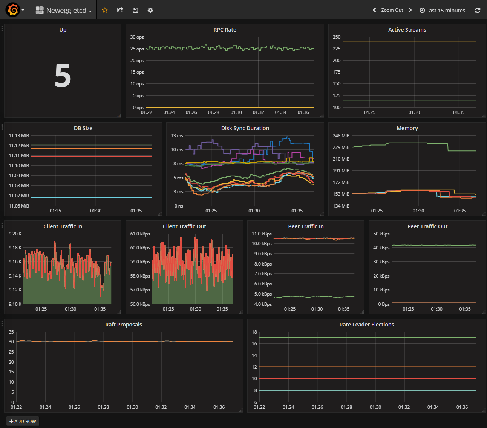

## Kubernetes Tutorials (4)

# How to Monitoring and Backup etcd service on CoreOS 

## Monitoring etcd

[Reference: Monitoring etcd](https://coreos.com/etcd/docs/latest/op-guide/monitoring.html)

Each etcd server exports metrics under the /metrics path on its client port.

The metrics can be fetched with curl:

>The official document using `curl -L http://localhost:2379/metrics` to fetch the etcd metric. But for we have set the TLS security for the etcd cluster, we should use the CA cert, Client cert and key file that we generated at  ***Kubernetes Tutorial 2 How to generate certificates for ETCD***.

```bash
curl --insecure --cert-type pem --cert /etc/ssl/certs/client.pem  --key  /etc/ssl/certs/client-key.pem  -L https://172.16.164.102:2379/metrics
```

And these are part of the metrics and their values, just for reference :

```bash
# HELP etcd_debugging_mvcc_db_compaction_pause_duration_milliseconds Bucketed histogram of db compaction pause duration.
# TYPE etcd_debugging_mvcc_db_compaction_pause_duration_milliseconds histogram
etcd_debugging_mvcc_db_compaction_pause_duration_milliseconds_bucket{le="1"} 0
...
etcd_debugging_mvcc_db_compaction_pause_duration_milliseconds_bucket{le="+Inf"} 0
etcd_debugging_mvcc_db_compaction_pause_duration_milliseconds_sum 0
etcd_debugging_mvcc_db_compaction_pause_duration_milliseconds_count 0
# HELP etcd_debugging_mvcc_db_compaction_total_duration_milliseconds Bucketed histogram of db compaction total duration.
# TYPE etcd_debugging_mvcc_db_compaction_total_duration_milliseconds histogram
etcd_debugging_mvcc_db_compaction_total_duration_milliseconds_bucket{le="100"} 8953
...

etcd_debugging_mvcc_db_compaction_total_duration_milliseconds_count 8953
# HELP etcd_debugging_mvcc_db_total_size_in_bytes Total size of the underlying database in bytes.
# TYPE etcd_debugging_mvcc_db_total_size_in_bytes gauge
etcd_debugging_mvcc_db_total_size_in_bytes 1.1657216e+07
# HELP etcd_debugging_mvcc_delete_total Total number of deletes seen by this member.
# TYPE etcd_debugging_mvcc_delete_total counter
etcd_debugging_mvcc_delete_total 0
# HELP etcd_debugging_mvcc_events_total Total number of events sent by this member.
# TYPE etcd_debugging_mvcc_events_total counter
etcd_debugging_mvcc_events_total 750654
# HELP etcd_debugging_mvcc_index_compaction_pause_duration_milliseconds Bucketed histogram of index compaction pause duration.
# TYPE etcd_debugging_mvcc_index_compaction_pause_duration_milliseconds histogram
etcd_debugging_mvcc_index_compaction_pause_duration_milliseconds_bucket{le="0.5"} 4143
...
```
___

## [Prometheus](https://prometheus.io/)

Running a Prometheus monitoring service is the easiest way to ingest and record etcd's metrics.

>The official document is to install a binary of Prometheus into the etcd cluster nodes. Instead of doing this, we will using the official prometheus docker image running in the remote server.

Here is the official prometheus docker image web-page. 


Let's login the CA server as root

|   ServerName  |   IP Address  |   vCPU    |   Memory(GB)  |   HDisk(GB)   |   Descriptions |
|:---:|:---:|:---:|:---:|:---:|:---:|
|E11K8SCA01|172.16.164.99|2|2|20|Certificates Generator & Http File Service|

## Step 1: Pull the images 

```bash
docker pull prom/prometheus
```

## Step 2: Create a Prometheus config file

/prometheus-data/prometheus.yml

```yaml
# my global config

global:

  scrape_interval:     10s # By default, scrape targets every 15 seconds.

  evaluation_interval: 10s # By default, scrape targets every 15 seconds.

  # scrape_timeout is set to the global default (10s).


# Load and evaluate rules in this file every 'evaluation_interval' seconds.

rule_files:

  # - "first.rules"

  # - "second.rules"


# A scrape configuration containing exactly one endpoint to scrape:

# Here it's Prometheus itself.

scrape_configs:

  # The job name is added as a label `job=<job_name>` to any timeseries scraped from this config.

  - job_name: 'etcd3'


    # Override the global default and scrape targets from this job every 5 seconds.

    scrape_interval: 10s

    scrape_timeout: 10s

    scheme: https

    # metrics_path defaults to '/metrics'

    # scheme defaults to 'http'.


    static_configs:

      - targets: ['172.16.164.101:2379','172.16.164.102:2379','172.16.164.103:2379','172.16.164.104:2379','172.16.164.105:2379']

    tls_config:
        # CA certificate to validate API server certificate with.
        ca_file: /cfssl/newegg-etcd-root-ca.pem

        # Certificate and key files for client cert authentication to the server.
        cert_file: /cfssl/client.pem
        key_file: /cfssl/client-key.pem

```

This is a quit simple config of the prometheus.

From the `scrape_configs:` we create a new job named: `'etcd3'`.

```yaml
scrape_configs:
  - job_name: 'etcd3'
```

Then we set the 'scape_interval' to 10s, that means every 10s, prometheus will connect to the etcd cluster metrics page and grab the values.

For we also set the TLS security mode, we need change the scheme to `'https'`.

> Note: If you're not using the TLS security mode, set here as 'http', and remove all `'tls_config'`. 

```yaml
    scrape_interval: 10s
    scrape_timeout: 10s
    scheme: https
```
List all your etcd nodes here, separate with comma.

```yaml
    static_configs:
      - targets: ['172.16.164.101:2379','172.16.164.102:2379','172.16.164.103:2379','172.16.164.104:2379','172.16.164.105:2379']
```

Set the path of the your etcd CA certificate file, Client cert and key file here.

```yaml
    tls_config:
        # CA certificate to validate API server certificate with.
        ca_file: /cfssl/newegg-etcd-root-ca.pem
        # Certificate and key files for client cert authentication to the server.
        cert_file: /cfssl/client.pem
        key_file: /cfssl/client-key.pem
```

___

## Step 3 : Run the Prometheus docker container 

```
docker run -d -p 9090:9090 --name=prometheus -v /prometheus-data/prometheus.yml:/etc/prometheus/prometheus.yml -v /cfssl:/cfssl prom/prometheus
```

> Run prometheus container at local port 9090, mount `/prometheus-data/prometheus.yml` to `/etc/prometheus/prometheus.yml`, also mount the `/cfssl` folder which contains  etcd CA certificate file, Client cert and key file.

Check the status with `docker ps` 

```bash
[root@e11k8sca01 ~]# docker ps
CONTAINER ID        IMAGE               COMMAND                  CREATED             STATUS              PORTS                    NAMES
90db22c28754        prom/prometheus     "/bin/prometheus -con"   5 weeks ago         Up 5 weeks          0.0.0.0:9090->9090/tcp   prometheus
```

## Step 4: Access the Prometheus web page 

Access the `http://${docker_host_ip}:9090`


Let's review the `targets`, we can see the job name `etcd3` there and all 5 nodes' state are `'UP'`.


Now we know the prometheus works properly.

## [Grafana](https://grafana.com/)  

The analytics platform for all your metrics.

Grafana allows you to query, visualize, alert on and understand your metrics no matter where they are stored. Create, explore, and share dashboards with your team and foster a data driven culture.

>Like prometheus. The official document is to install a binary of GrafanaInstead of doing this, we will using the official Grafana docker image running in the remote server.


## Step 1: Pull the image

```bash
docker pull prom/prometheus
```

## Step2: Run the grafana docker container 

```bash
docker run -d --name=grafana -p 3000:3000 grafana/grafana
```

Running the grafana container as daemon and expose the port '3000'.

## Step 3: Access the Grafana Web console and login 

Access the `http://${docker_host_ip}:3000`


Login with the default account ***admin: admin***

## Step 4: Add Prometheus DataSource

Click the side menu and select `Data Sources`


Add Prometheus Data Source as shown in below picture:


> Change the Name you like and the URL of your own docker host.

Click Save and Test to make sure it works.


## Step 5: Import the Grafana Dashboard

Click Side menu --> Dashboards --> Import.


Paste the below Json code on the field which I marked with red rectangle. Then click the `Load` button. 

```json
{
  "__inputs": [
    {
      "name": "DS_ETCD3",
      "label": "ETCD3",
      "description": "",
      "type": "datasource",
      "pluginId": "prometheus",
      "pluginName": "Prometheus"
    }
  ],
  "__requires": [
    {
      "type": "grafana",
      "id": "grafana",
      "name": "Grafana",
      "version": "4.2.0"
    },
    {
      "type": "panel",
      "id": "graph",
      "name": "Graph",
      "version": ""
    },
    {
      "type": "datasource",
      "id": "prometheus",
      "name": "Prometheus",
      "version": "1.0.0"
    },
    {
      "type": "panel",
      "id": "singlestat",
      "name": "Singlestat",
      "version": ""
    }
  ],
  "annotations": {
    "list": []
  },
  "description": "etcd sample Grafana dashboard with Prometheus",
  "editable": true,
  "gnetId": null,
  "graphTooltip": 0,
  "hideControls": false,
  "id": null,
  "links": [],
  "refresh": false,
  "rows": [
    {
      "collapse": false,
      "height": "250px",
      "panels": [
        {
          "cacheTimeout": null,
          "colorBackground": false,
          "colorValue": false,
          "colors": [
            "rgba(245, 54, 54, 0.9)",
            "rgba(237, 129, 40, 0.89)",
            "rgba(50, 172, 45, 0.97)"
          ],
          "datasource": "${DS_ETCD3}",
          "editable": true,
          "error": false,
          "format": "none",
          "gauge": {
            "maxValue": 100,
            "minValue": 0,
            "show": false,
            "thresholdLabels": false,
            "thresholdMarkers": true
          },
          "id": 28,
          "interval": null,
          "links": [],
          "mappingType": 1,
          "mappingTypes": [
            {
              "name": "value to text",
              "value": 1
            },
            {
              "name": "range to text",
              "value": 2
            }
          ],
          "maxDataPoints": 100,
          "nullPointMode": "connected",
          "nullText": null,
          "postfix": "",
          "postfixFontSize": "50%",
          "prefix": "",
          "prefixFontSize": "50%",
          "rangeMaps": [
            {
              "from": "null",
              "text": "N/A",
              "to": "null"
            }
          ],
          "span": 3,
          "sparkline": {
            "fillColor": "rgba(31, 118, 189, 0.18)",
            "full": false,
            "lineColor": "rgb(31, 120, 193)",
            "show": false
          },
          "targets": [
            {
              "expr": "sum(etcd_server_has_leader)",
              "intervalFactor": 2,
              "legendFormat": "",
              "metric": "etcd_server_has_leader",
              "refId": "A",
              "step": 20
            }
          ],
          "thresholds": "",
          "title": "Up",
          "type": "singlestat",
          "valueFontSize": "200%",
          "valueMaps": [
            {
              "op": "=",
              "text": "N/A",
              "value": "null"
            }
          ],
          "valueName": "avg"
        },
        {
          "aliasColors": {},
          "bars": false,
          "datasource": "${DS_ETCD3}",
          "editable": true,
          "error": false,
          "fill": 0,
          "id": 23,
          "legend": {
            "avg": false,
            "current": false,
            "max": false,
            "min": false,
            "show": false,
            "total": false,
            "values": false
          },
          "lines": true,
          "linewidth": 2,
          "links": [],
          "nullPointMode": "connected",
          "percentage": false,
          "pointradius": 5,
          "points": false,
          "renderer": "flot",
          "seriesOverrides": [],
          "span": 5,
          "stack": false,
          "steppedLine": false,
          "targets": [
            {
              "expr": "sum(rate({grpc_type=\"unary\",grpc_code!=\"OK\"} [1m]))",
              "intervalFactor": 2,
              "legendFormat": "{{instance}} RPC Rate",
              "metric": "grpc_server_started_total",
              "refId": "A",
              "step": 2
            },
            {
              "expr": "sum(rate(grpc_server_started_total{grpc_type=\"unary\",grpc_code!=\"OK\"} [1m])) - sum(rate(grpc_server_handled_total{grpc_type=\"unary\"} [1m]))",
              "intervalFactor": 2,
              "legendFormat": "{{instance}} RPC Failed Rate",
              "metric": "grpc_server_handled_total",
              "refId": "B",
              "step": 2
            }
          ],
          "thresholds": [],
          "timeFrom": null,
          "timeShift": null,
          "title": "RPC Rate",
          "tooltip": {
            "msResolution": false,
            "shared": true,
            "sort": 0,
            "value_type": "individual"
          },
          "type": "graph",
          "xaxis": {
            "mode": "time",
            "name": null,
            "show": true,
            "values": []
          },
          "yaxes": [
            {
              "format": "ops",
              "label": null,
              "logBase": 1,
              "max": null,
              "min": null,
              "show": true
            },
            {
              "format": "short",
              "label": null,
              "logBase": 1,
              "max": null,
              "min": null,
              "show": true
            }
          ]
        },
        {
          "aliasColors": {},
          "bars": false,
          "datasource": "${DS_ETCD3}",
          "editable": true,
          "error": false,
          "fill": 0,
          "id": 41,
          "legend": {
            "avg": false,
            "current": false,
            "max": false,
            "min": false,
            "show": false,
            "total": false,
            "values": false
          },
          "lines": true,
          "linewidth": 2,
          "links": [],
          "nullPointMode": "connected",
          "percentage": false,
          "pointradius": 5,
          "points": false,
          "renderer": "flot",
          "seriesOverrides": [],
          "span": 4,
          "stack": true,
          "steppedLine": false,
          "targets": [
            {
              "expr": "sum(grpc_server_started_total {grpc_service=\"etcdserverpb.Watch\",grpc_type=\"bidi_stream\",grpc_code!=\"OK\"}) - sum(grpc_server_handled_total {grpc_service=\"etcdserverpb.Watch\",grpc_type=\"bidi_stream\"})",
              "intervalFactor": 2,
              "legendFormat": "Watch Streams",
              "metric": "grpc_server_handled_total",
              "refId": "A",
              "step": 2
            },
            {
              "expr": "sum(grpc_server_started_total {grpc_service=\"etcdserverpb.Lease\",grpc_type=\"bidi_stream\"}) - sum(grpc_server_handled_total {grpc_service=\"etcdserverpb.Lease\",grpc_type=\"bidi_stream\"})",
              "intervalFactor": 2,
              "legendFormat": "Lease Streams",
              "metric": "grpc_server_handled_total",
              "refId": "B",
              "step": 2
            }
          ],
          "thresholds": [],
          "timeFrom": null,
          "timeShift": null,
          "title": "Active Streams",
          "tooltip": {
            "msResolution": false,
            "shared": true,
            "sort": 0,
            "value_type": "individual"
          },
          "type": "graph",
          "xaxis": {
            "mode": "time",
            "name": null,
            "show": true,
            "values": []
          },
          "yaxes": [
            {
              "format": "short",
              "label": "",
              "logBase": 1,
              "max": null,
              "min": null,
              "show": true
            },
            {
              "format": "short",
              "label": null,
              "logBase": 1,
              "max": null,
              "min": null,
              "show": true
            }
          ]
        }
      ],
      "repeat": null,
      "repeatIteration": null,
      "repeatRowId": null,
      "showTitle": false,
      "title": "Row",
      "titleSize": "h6"
    },
    {
      "collapse": false,
      "height": "250px",
      "panels": [
        {
          "aliasColors": {},
          "bars": false,
          "datasource": "${DS_ETCD3}",
          "decimals": null,
          "editable": true,
          "error": false,
          "fill": 0,
          "grid": {},
          "id": 1,
          "legend": {
            "avg": false,
            "current": false,
            "max": false,
            "min": false,
            "show": false,
            "total": false,
            "values": false
          },
          "lines": true,
          "linewidth": 2,
          "links": [],
          "nullPointMode": "connected",
          "percentage": false,
          "pointradius": 5,
          "points": false,
          "renderer": "flot",
          "seriesOverrides": [],
          "span": 4,
          "stack": false,
          "steppedLine": false,
          "targets": [
            {
              "expr": "etcd_debugging_mvcc_db_total_size_in_bytes",
              "hide": false,
              "interval": "",
              "intervalFactor": 2,
              "legendFormat": "{{instance}} DB Size",
              "metric": "",
              "refId": "A",
              "step": 2
            }
          ],
          "thresholds": [],
          "timeFrom": null,
          "timeShift": null,
          "title": "DB Size",
          "tooltip": {
            "msResolution": false,
            "shared": true,
            "sort": 0,
            "value_type": "cumulative"
          },
          "type": "graph",
          "xaxis": {
            "mode": "time",
            "name": null,
            "show": true,
            "values": []
          },
          "yaxes": [
            {
              "format": "bytes",
              "logBase": 1,
              "max": null,
              "min": null,
              "show": true
            },
            {
              "format": "short",
              "logBase": 1,
              "max": null,
              "min": null,
              "show": false
            }
          ]
        },
        {
          "aliasColors": {},
          "bars": false,
          "datasource": "${DS_ETCD3}",
          "editable": true,
          "error": false,
          "fill": 0,
          "grid": {},
          "id": 3,
          "legend": {
            "avg": false,
            "current": false,
            "max": false,
            "min": false,
            "show": false,
            "total": false,
            "values": false
          },
          "lines": true,
          "linewidth": 2,
          "links": [],
          "nullPointMode": "connected",
          "percentage": false,
          "pointradius": 1,
          "points": false,
          "renderer": "flot",
          "seriesOverrides": [],
          "span": 4,
          "stack": false,
          "steppedLine": true,
          "targets": [
            {
              "expr": "histogram_quantile(0.99, sum(rate(etcd_disk_wal_fsync_duration_seconds_bucket [5m])) by (instance, le))",
              "hide": false,
              "intervalFactor": 2,
              "legendFormat": "{{instance}} WAL fsync",
              "metric": "etcd_disk_wal_fsync_duration_seconds_bucket",
              "refId": "A",
              "step": 2
            },
            {
              "expr": "histogram_quantile(0.99, sum(rate(etcd_disk_backend_commit_duration_seconds_bucket [5m])) by (instance, le))",
              "intervalFactor": 2,
              "legendFormat": "{{instance}} DB fsync",
              "metric": "etcd_disk_backend_commit_duration_seconds_bucket",
              "refId": "B",
              "step": 2
            }
          ],
          "thresholds": [],
          "timeFrom": null,
          "timeShift": null,
          "title": "Disk Sync Duration",
          "tooltip": {
            "msResolution": false,
            "shared": true,
            "sort": 0,
            "value_type": "cumulative"
          },
          "type": "graph",
          "xaxis": {
            "mode": "time",
            "name": null,
            "show": true,
            "values": []
          },
          "yaxes": [
            {
              "format": "s",
              "logBase": 1,
              "max": null,
              "min": null,
              "show": true
            },
            {
              "format": "short",
              "logBase": 1,
              "max": null,
              "min": null,
              "show": false
            }
          ]
        },
        {
          "aliasColors": {},
          "bars": false,
          "datasource": "${DS_ETCD3}",
          "editable": true,
          "error": false,
          "fill": 0,
          "id": 29,
          "legend": {
            "avg": false,
            "current": false,
            "max": false,
            "min": false,
            "show": false,
            "total": false,
            "values": false
          },
          "lines": true,
          "linewidth": 2,
          "links": [],
          "nullPointMode": "connected",
          "percentage": false,
          "pointradius": 5,
          "points": false,
          "renderer": "flot",
          "seriesOverrides": [],
          "span": 4,
          "stack": false,
          "steppedLine": false,
          "targets": [
            {
              "expr": "process_resident_memory_bytes",
              "intervalFactor": 2,
              "legendFormat": "{{instance}} Resident Memory",
              "metric": "process_resident_memory_bytes",
              "refId": "A",
              "step": 2
            }
          ],
          "thresholds": [],
          "timeFrom": null,
          "timeShift": null,
          "title": "Memory",
          "tooltip": {
            "msResolution": false,
            "shared": true,
            "sort": 0,
            "value_type": "individual"
          },
          "type": "graph",
          "xaxis": {
            "mode": "time",
            "name": null,
            "show": true,
            "values": []
          },
          "yaxes": [
            {
              "format": "bytes",
              "label": null,
              "logBase": 1,
              "max": null,
              "min": null,
              "show": true
            },
            {
              "format": "short",
              "label": null,
              "logBase": 1,
              "max": null,
              "min": null,
              "show": true
            }
          ]
        }
      ],
      "repeat": null,
      "repeatIteration": null,
      "repeatRowId": null,
      "showTitle": false,
      "title": "New row",
      "titleSize": "h6"
    },
    {
      "collapse": false,
      "height": "250px",
      "panels": [
        {
          "aliasColors": {},
          "bars": false,
          "datasource": "${DS_ETCD3}",
          "editable": true,
          "error": false,
          "fill": 5,
          "id": 22,
          "legend": {
            "avg": false,
            "current": false,
            "max": false,
            "min": false,
            "show": false,
            "total": false,
            "values": false
          },
          "lines": true,
          "linewidth": 2,
          "links": [],
          "nullPointMode": "connected",
          "percentage": false,
          "pointradius": 5,
          "points": false,
          "renderer": "flot",
          "seriesOverrides": [],
          "span": 3,
          "stack": true,
          "steppedLine": false,
          "targets": [
            {
              "expr": "rate(etcd_network_client_grpc_received_bytes_total [1m])",
              "intervalFactor": 2,
              "legendFormat": "{{instance}} Client Traffic In",
              "metric": "etcd_network_client_grpc_received_bytes_total",
              "refId": "A",
              "step": 4
            }
          ],
          "thresholds": [],
          "timeFrom": null,
          "timeShift": null,
          "title": "Client Traffic In",
          "tooltip": {
            "msResolution": false,
            "shared": true,
            "sort": 0,
            "value_type": "individual"
          },
          "type": "graph",
          "xaxis": {
            "mode": "time",
            "name": null,
            "show": true,
            "values": []
          },
          "yaxes": [
            {
              "format": "short",
              "label": null,
              "logBase": 1,
              "max": null,
              "min": null,
              "show": true
            },
            {
              "format": "short",
              "label": null,
              "logBase": 1,
              "max": null,
              "min": null,
              "show": true
            }
          ]
        },
        {
          "aliasColors": {},
          "bars": false,
          "datasource": "${DS_ETCD3}",
          "editable": true,
          "error": false,
          "fill": 5,
          "id": 21,
          "legend": {
            "avg": false,
            "current": false,
            "max": false,
            "min": false,
            "show": false,
            "total": false,
            "values": false
          },
          "lines": true,
          "linewidth": 2,
          "links": [],
          "nullPointMode": "connected",
          "percentage": false,
          "pointradius": 5,
          "points": false,
          "renderer": "flot",
          "seriesOverrides": [],
          "span": 3,
          "stack": true,
          "steppedLine": false,
          "targets": [
            {
              "expr": "rate(etcd_network_client_grpc_sent_bytes_total [1m])",
              "intervalFactor": 2,
              "legendFormat": "{{instance}} Client Traffic Out",
              "metric": "etcd_network_client_grpc_sent_bytes_total",
              "refId": "A",
              "step": 4
            }
          ],
          "thresholds": [],
          "timeFrom": null,
          "timeShift": null,
          "title": "Client Traffic Out",
          "tooltip": {
            "msResolution": false,
            "shared": true,
            "sort": 0,
            "value_type": "individual"
          },
          "type": "graph",
          "xaxis": {
            "mode": "time",
            "name": null,
            "show": true,
            "values": []
          },
          "yaxes": [
            {
              "format": "Bps",
              "label": null,
              "logBase": 1,
              "max": null,
              "min": null,
              "show": true
            },
            {
              "format": "short",
              "label": null,
              "logBase": 1,
              "max": null,
              "min": null,
              "show": true
            }
          ]
        },
        {
          "aliasColors": {},
          "bars": false,
          "datasource": "${DS_ETCD3}",
          "editable": true,
          "error": false,
          "fill": 0,
          "id": 20,
          "legend": {
            "avg": false,
            "current": false,
            "max": false,
            "min": false,
            "show": false,
            "total": false,
            "values": false
          },
          "lines": true,
          "linewidth": 2,
          "links": [],
          "nullPointMode": "connected",
          "percentage": false,
          "pointradius": 5,
          "points": false,
          "renderer": "flot",
          "seriesOverrides": [],
          "span": 3,
          "stack": false,
          "steppedLine": false,
          "targets": [
            {
              "expr": "sum(rate(etcd_network_peer_received_bytes_total [1m])) by (instance)",
              "intervalFactor": 2,
              "legendFormat": "{{instance}} Peer Traffic In",
              "metric": "etcd_network_peer_received_bytes_total",
              "refId": "A",
              "step": 4
            }
          ],
          "thresholds": [],
          "timeFrom": null,
          "timeShift": null,
          "title": "Peer Traffic In",
          "tooltip": {
            "msResolution": false,
            "shared": true,
            "sort": 0,
            "value_type": "individual"
          },
          "type": "graph",
          "xaxis": {
            "mode": "time",
            "name": null,
            "show": true,
            "values": []
          },
          "yaxes": [
            {
              "format": "Bps",
              "label": null,
              "logBase": 1,
              "max": null,
              "min": null,
              "show": true
            },
            {
              "format": "short",
              "label": null,
              "logBase": 1,
              "max": null,
              "min": null,
              "show": true
            }
          ]
        },
        {
          "aliasColors": {},
          "bars": false,
          "datasource": "${DS_ETCD3}",
          "decimals": null,
          "editable": true,
          "error": false,
          "fill": 0,
          "grid": {},
          "id": 16,
          "legend": {
            "avg": false,
            "current": false,
            "max": false,
            "min": false,
            "show": false,
            "total": false,
            "values": false
          },
          "lines": true,
          "linewidth": 2,
          "links": [],
          "nullPointMode": "connected",
          "percentage": false,
          "pointradius": 5,
          "points": false,
          "renderer": "flot",
          "seriesOverrides": [],
          "span": 3,
          "stack": false,
          "steppedLine": false,
          "targets": [
            {
              "expr": "sum(rate(etcd_network_peer_sent_bytes_total [1m])) by (instance)",
              "hide": false,
              "interval": "",
              "intervalFactor": 2,
              "legendFormat": "{{instance}} Peer Traffic Out",
              "metric": "etcd_network_peer_sent_bytes_total",
              "refId": "A",
              "step": 4
            }
          ],
          "thresholds": [],
          "timeFrom": null,
          "timeShift": null,
          "title": "Peer Traffic Out",
          "tooltip": {
            "msResolution": false,
            "shared": true,
            "sort": 0,
            "value_type": "cumulative"
          },
          "type": "graph",
          "xaxis": {
            "mode": "time",
            "name": null,
            "show": true,
            "values": []
          },
          "yaxes": [
            {
              "format": "Bps",
              "logBase": 1,
              "max": null,
              "min": null,
              "show": true
            },
            {
              "format": "short",
              "logBase": 1,
              "max": null,
              "min": null,
              "show": true
            }
          ]
        }
      ],
      "repeat": null,
      "repeatIteration": null,
      "repeatRowId": null,
      "showTitle": false,
      "title": "New row",
      "titleSize": "h6"
    },
    {
      "collapse": false,
      "height": "250px",
      "panels": [
        {
          "aliasColors": {},
          "bars": false,
          "datasource": "${DS_ETCD3}",
          "editable": true,
          "error": false,
          "fill": 0,
          "id": 40,
          "legend": {
            "avg": false,
            "current": false,
            "max": false,
            "min": false,
            "show": false,
            "total": false,
            "values": false
          },
          "lines": true,
          "linewidth": 2,
          "links": [],
          "nullPointMode": "connected",
          "percentage": false,
          "pointradius": 5,
          "points": false,
          "renderer": "flot",
          "seriesOverrides": [],
          "span": 6,
          "stack": false,
          "steppedLine": false,
          "targets": [
            {
              "expr": "sum(rate(etcd_server_proposals_failed_total [1m]))",
              "intervalFactor": 2,
              "legendFormat": "Proposal Failure Rate",
              "metric": "etcd_server_proposals_failed_total",
              "refId": "A",
              "step": 2
            },
            {
              "expr": "sum(etcd_server_proposals_pending)",
              "intervalFactor": 2,
              "legendFormat": "Proposal Pending Total",
              "metric": "etcd_server_proposals_pending",
              "refId": "B",
              "step": 2
            },
            {
              "expr": "sum(rate(etcd_server_proposals_committed_total [1m]))",
              "intervalFactor": 2,
              "legendFormat": "Proposal Commit Rate",
              "metric": "etcd_server_proposals_committed_total",
              "refId": "C",
              "step": 2
            },
            {
              "expr": "sum(rate(etcd_server_proposals_applied_total [1m]))",
              "intervalFactor": 2,
              "legendFormat": "Proposal Apply Rate",
              "refId": "D",
              "step": 2
            }
          ],
          "thresholds": [],
          "timeFrom": null,
          "timeShift": null,
          "title": "Raft Proposals",
          "tooltip": {
            "msResolution": false,
            "shared": true,
            "sort": 0,
            "value_type": "individual"
          },
          "type": "graph",
          "xaxis": {
            "mode": "time",
            "name": null,
            "show": true,
            "values": []
          },
          "yaxes": [
            {
              "format": "short",
              "label": "",
              "logBase": 1,
              "max": null,
              "min": null,
              "show": true
            },
            {
              "format": "short",
              "label": null,
              "logBase": 1,
              "max": null,
              "min": null,
              "show": true
            }
          ]
        },
        {
          "aliasColors": {},
          "bars": false,
          "datasource": "${DS_ETCD3}",
          "decimals": 0,
          "editable": true,
          "error": false,
          "fill": 0,
          "id": 19,
          "legend": {
            "alignAsTable": false,
            "avg": false,
            "current": false,
            "max": false,
            "min": false,
            "rightSide": false,
            "show": false,
            "total": false,
            "values": false
          },
          "lines": true,
          "linewidth": 2,
          "links": [],
          "nullPointMode": "connected",
          "percentage": false,
          "pointradius": 5,
          "points": false,
          "renderer": "flot",
          "seriesOverrides": [],
          "span": 6,
          "stack": false,
          "steppedLine": false,
          "targets": [
            {
              "expr": "etcd_server_leader_changes_seen_total",
              "intervalFactor": 2,
              "legendFormat": "{{instance}} Leader Change Seen",
              "metric": "etcd_server_leader_changes_seen_total",
              "refId": "A",
              "step": 2
            }
          ],
          "thresholds": [],
          "timeFrom": null,
          "timeShift": null,
          "title": "Rate Leader Elections",
          "tooltip": {
            "msResolution": false,
            "shared": true,
            "sort": 0,
            "value_type": "individual"
          },
          "type": "graph",
          "xaxis": {
            "mode": "time",
            "name": null,
            "show": true,
            "values": []
          },
          "yaxes": [
            {
              "format": "short",
              "label": null,
              "logBase": 1,
              "max": null,
              "min": null,
              "show": true
            },
            {
              "format": "short",
              "label": null,
              "logBase": 1,
              "max": null,
              "min": null,
              "show": true
            }
          ]
        }
      ],
      "repeat": null,
      "repeatIteration": null,
      "repeatRowId": null,
      "showTitle": false,
      "title": "New row",
      "titleSize": "h6"
    }
  ],
  "schemaVersion": 14,
  "style": "dark",
  "tags": [],
  "templating": {
    "list": []
  },
  "time": {
    "from": "now-15m",
    "to": "now"
  },
  "timepicker": {
    "now": true,
    "refresh_intervals": [
      "5s",
      "10s",
      "30s",
      "1m",
      "5m",
      "15m",
      "30m",
      "1h",
      "2h",
      "1d"
    ],
    "time_options": [
      "5m",
      "15m",
      "1h",
      "6h",
      "12h",
      "24h",
      "2d",
      "7d",
      "30d"
    ]
  },
  "timezone": "browser",
  "title": "Newegg-etcd",
  "version": 2
}
```
>Note: If your  Data Source name is not ETCD3, you have to change the all the data source setting in the json file.

from 

```json
    "datasource": "${DS_ETCD3}",
``` 

to 

```json
    "datasource": "${DS_$(YOUR_NAME)}",
``` 

Check the Dashboard name and Select the right Data Source, then Click *`import`*.


## Step 6: The etcd cluster prometheus-grafana dashboard 


