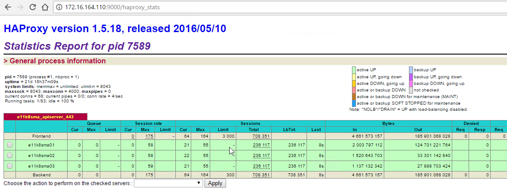

## Kubernetes Tutorials (5)

# How to Install and Config HAproxy+KeepAlived for Kubernetes API-Servers

## Quick Review


From Tutorial 1~4, we have finished build the etcd cluster. 

>Although it's not too hard and complicated, but still it's the database of the Kubernetes Cluster, if ETCD dead, Kubernetes is dead.

>So Please be more careful when you work with it.

Next, let's focus this Haproxy + Keepalived part and prepare for the Kubernetes Master implementation.


## Sever Spec 

    OS System:  CentOS 7.3.1611
    CPU      :  4vCPU
    Memory   :  4GB
    HDISK    :  60GB
    VIP      :  172.16.164.110
    OpenPort :  80, 443
    Master   :  E11K8SHAPX01
    IP       :  172.16.164.108
    Backup    :  E11K8SHAPX02
    IP       :  172.16.164.109
## Server List 

|       ServerName     |    IP ADDRESS    |     VCPU      |     MEMORY(GB)      |     DISK(GB)      |
|:--------------------:|:----------------:|:-------------:|:-------------------:|:-----------------:|
|   E11K8SHAPX01       |   172.16.164.108 |      4        |         4           |         40        |
|   E11K8SHAPX02       |   172.16.164.109 |      4        |         4           |         40        |


___

# Step by Step 

[Click Here For Reference](https://access.redhat.com/documentation/en-US/Red_Hat_Enterprise_Linux/7/html/Load_Balancer_Administration/)

## Step 1: Install the Keepalived 

Install keepalived is simple.

```bash
yum install keepalived -y
```

After a while, your keepalived will be installed with it's dependence together.

Don't forget to install them in both servers.

## Step 2: Keepalived Configuration 

Config the keepalived.conf.

```bash
vi /etc/keepalived/keepalived.conf
```

Remove everything inside and paste code as below on the Master Node:

```yaml
! Configuration File for keepalived

global_defs {
   notification_email {
     jude.x.zhu@newegg.com
   }
   notification_email_from haproxy@e11k8shapx01
   smtp_server 10.1.37.41
   smtp_connect_timeout 30
   router_id E11ECHAPX
}


vrrp_script chk_haproxy {
  script "killall -0 haproxy"
  interval 2 # every 2 seconds
  weight 2 # add 2 points if OK
}

vrrp_instance VI_1 {
    state MASTER
    interface eno16780032
    virtual_router_id 51
    priority 101
    advert_int 1
    smtp_alert
    authentication {
        auth_type PASS
        auth_pass 12345678
    }
    virtual_ipaddress {
                172.16.164.110 brd 172.16.15.255 dev eno16780032
    }

    track_script {
        chk_haproxy
    }
``` 

Save and Exit

Do the same on the Backup Node, but the config would a little different:

```yaml
! Configuration File for keepalived

global_defs {
   notification_email {
     jude.x.zhu@newegg.com
   }
   notification_email_from haproxy@e11k8shapx01
   smtp_server 10.1.37.41
   smtp_connect_timeout 30
   router_id E11ECHAPX
}


vrrp_script chk_haproxy {
  script "killall -0 haproxy"
  interval 2 # every 2 seconds
  weight 2 # add 2 points if OK
}

vrrp_instance VI_1 {
    state BACKUP
    interface eno16780032
    virtual_router_id 51
    priority 100
    advert_int 1
    smtp_alert
    authentication {
        auth_type PASS
        auth_pass 12345678
    }
    virtual_ipaddress {
                172.16.164.110 brd 172.16.15.255 dev eno16780032
    }

    track_script {
        chk_haproxy
    }
}
``` 

Don' start the services yet. We will do it after install haproxy.(If you look carefully on the keepalived configuration, you will figure out why.)

## Step 3: Install Haproxy 

Install haproxy is simple.

```bash
yum install haproxy -y
```

After a while, your haproxy will be installed.

Don't forget to install them in both serers.


## Step 4: Haproxy Configuration 

Config the haproxy.cfg.

```bash
vi /etc/haproxy/haproxy.cfg
```
Remove everything inside and paste code as below on both Servers:

```yaml
#---------------------------------------------------------------------
# Example configuration for a possible web application.  See the
# full configuration options online.
#
#   http://haproxy.1wt.eu/download/1.4/doc/configuration.txt
#
#---------------------------------------------------------------------

#---------------------------------------------------------------------
# Global settings
#---------------------------------------------------------------------
global
    # to have these messages end up in /var/log/haproxy.log you will
    # need to:
    #
    # 1) configure syslog to accept network log events.  This is done
    #    by adding the '-r' option to the SYSLOGD_OPTIONS in
    #    /etc/sysconfig/syslog
    #
    # 2) configure local2 events to go to the /var/log/haproxy.log
    #   file. A line like the following can be added to
    #   /etc/sysconfig/syslog
    #
    #    local2.*                       /var/log/haproxy.log
    #
    log         127.0.0.1 local2

    chroot      /var/lib/haproxy
    pidfile     /var/run/haproxy.pid
    maxconn     4000
    user        haproxy
    group       haproxy
    daemon

    # turn on stats unix socket
    stats socket /var/lib/haproxy/stats

#---------------------------------------------------------------------
# common defaults that all the 'listen' and 'backend' sections will
# use if not designated in their block
#---------------------------------------------------------------------
defaults
    mode                    http
    log                     global
    option                  httplog
    option                  dontlognull
    option http-server-close
    option forwardfor       except 127.0.0.0/8
    option                  redispatch
    retries                 3
    timeout http-request    10s
    timeout queue           1m
    timeout connect         10s
    timeout client          1m
    timeout server          1m
    timeout http-keep-alive 10s
    timeout check           10s
    maxconn                 3000

##---------------------------------------------------------------------
## e11k8s api service
##---------------------------------------------------------------------
listen e11k8sma_apiserver_443
    bind 0.0.0.0:443
    mode tcp
        balance roundrobin
        server e11k8sma01 172.16.164.111:443 check
        server e11k8sma02 172.16.164.112:443 check
        server e11k8sma03 172.16.164.113:443 check
    
##---------------------------------------------------------------------
## e11k8s ingress
##---------------------------------------------------------------------
listen e11k8s_ingress_80
    bind 0.0.0.0:80
    mode http
        balance roundrobin
        server e11k8swk01 172.16.164.121:80 check
        server e11k8swk03 172.16.164.123:80 check
        server e11k8swk05 172.16.164.125:80 check

##---------------------------------------------------------------------
## s7mariadb ingress
##---------------------------------------------------------------------
listen s7mariadb_3306
    bind 0.0.0.0:3306
    mode tcp
        balance roundrobin
        server s7mariadb01 172.16.76.61:3306 check
        server s7mariadb02 172.16.76.62:3306 check
        server s7mariadb03 172.16.76.63:3306 check

##---------------------------------------------------------------------
## health status
##---------------------------------------------------------------------


listen stats 0.0.0.0:9000       #Listen on all IP's on port 9000
    mode http
    balance
    timeout client 5000
    timeout connect 4000
    timeout server 30000

    #This is the virtual URL to access the stats page
    stats uri /haproxy_stats

    #Authentication realm. This can be set to anything. Escape space characters with a backslash.
    stats realm HAProxy\ Statistics

    #The user/pass you want to use. Change this password!
#    stats auth admin:passwordhere

    #This allows you to take down and bring up back end servers.
    #This will produce an error on older versions of HAProxy.
    stats admin if TRUE
```

## Step 5: Start and Enable Services

Simply run below command to enable and run the haproxy and the keepalived services on both servers.

```bash
systemctl enable haproxy
systemctl enable keepalived

systemctl start haproxy
systemctl start keepalived
```

## Step 6: Check the result 

Check the Haproxy status by running below command on both servers.


```
systemctl status haproxy 
```

Also we can check the status page we set inthe haproxy.cfg

 

> Note: You will see red (which mean errors) instead of green here. Why? for we haven't deploy the kubernetes Master Nodes and the API-Server port , *443* , are not opened yet.

 Check the Haproxy status by running below command on both servers.


```
systemctl status keepalived 
```

Also let check the VIP location .

```bash
[root@e11k8shapx01 ~]# ip a
1: lo: <LOOPBACK,UP,LOWER_UP> mtu 65536 qdisc noqueue state UNKNOWN qlen 1
    link/loopback 00:00:00:00:00:00 brd 00:00:00:00:00:00
    inet 127.0.0.1/8 scope host lo
       valid_lft forever preferred_lft forever
    inet6 ::1/128 scope host 
       valid_lft forever preferred_lft forever
2: eno16780032: <BROADCAST,MULTICAST,UP,LOWER_UP> mtu 1500 qdisc mq state UP qlen 1000
    link/ether 00:0c:29:d5:2e:a1 brd ff:ff:ff:ff:ff:ff
    inet 172.16.164.108/24 brd 172.16.164.255 scope global eno16780032
       valid_lft forever preferred_lft forever
    inet 172.16.164.110/32 brd 172.16.15.255 scope global eno16780032
       valid_lft forever preferred_lft forever
    inet6 fe80::20c:29ff:fed5:2ea1/64 scope link 
       valid_lft forever preferred_lft forever

```

```bash
[root@e11k8shapx02 ~]# ip a
1: lo: <LOOPBACK,UP,LOWER_UP> mtu 65536 qdisc noqueue state UNKNOWN qlen 1
    link/loopback 00:00:00:00:00:00 brd 00:00:00:00:00:00
    inet 127.0.0.1/8 scope host lo
       valid_lft forever preferred_lft forever
    inet6 ::1/128 scope host 
       valid_lft forever preferred_lft forever
2: eno16780032: <BROADCAST,MULTICAST,UP,LOWER_UP> mtu 1500 qdisc mq state UP qlen 1000
    link/ether 00:0c:29:69:10:9e brd ff:ff:ff:ff:ff:ff
    inet 172.16.164.109/24 brd 172.16.164.255 scope global eno16780032
       valid_lft forever preferred_lft forever
    inet6 fe80::20c:29ff:fe69:109e/64 scope link 
       valid_lft forever preferred_lft forever
```

We can see at the master node , it has two IP addresses, one is its own IP address, and the other one is the VIP we need.

On the other side, the Backup node only has one IP address.

##  Step 7: Test

Let's do some test.

Stop the haproxy service on the master node by running:

```bash
systemctl stop haproxy
```

We will see the VIP is no longer on the master node.

```bash
[root@e11k8shapx01 ~]# ip a
1: lo: <LOOPBACK,UP,LOWER_UP> mtu 65536 qdisc noqueue state UNKNOWN qlen 1
    link/loopback 00:00:00:00:00:00 brd 00:00:00:00:00:00
    inet 127.0.0.1/8 scope host lo
       valid_lft forever preferred_lft forever
    inet6 ::1/128 scope host 
       valid_lft forever preferred_lft forever
2: eno16780032: <BROADCAST,MULTICAST,UP,LOWER_UP> mtu 1500 qdisc mq state UP qlen 1000
    link/ether 00:0c:29:d5:2e:a1 brd ff:ff:ff:ff:ff:ff
    inet 172.16.164.108/24 brd 172.16.164.255 scope global eno16780032
       valid_lft forever preferred_lft forever
    inet6 fe80::20c:29ff:fed5:2ea1/64 scope link 
       valid_lft forever preferred_lft forever
``` 

And the Backup node is holding the VIP now

```bash
[root@e11k8shapx02 ~]# ip a
1: lo: <LOOPBACK,UP,LOWER_UP> mtu 65536 qdisc noqueue state UNKNOWN qlen 1
    link/loopback 00:00:00:00:00:00 brd 00:00:00:00:00:00
    inet 127.0.0.1/8 scope host lo
       valid_lft forever preferred_lft forever
    inet6 ::1/128 scope host 
       valid_lft forever preferred_lft forever
2: eno16780032: <BROADCAST,MULTICAST,UP,LOWER_UP> mtu 1500 qdisc mq state UP qlen 1000
    link/ether 00:0c:29:69:10:9e brd ff:ff:ff:ff:ff:ff
    inet 172.16.164.109/24 brd 172.16.164.255 scope global eno16780032
       valid_lft forever preferred_lft forever
    inet 172.16.164.110/32 brd 172.16.15.255 scope global eno16780032
       valid_lft forever preferred_lft forever
    inet6 fe80::20c:29ff:fe69:109e/64 scope link 
       valid_lft forever preferred_lft forever
``` 

Start the haproxy on the Master Node , and the VIP will move back.

And if you set the Email alert right in the configuration, you would like to receive emails to tell you what happened to your haproxy servers, as below:

  