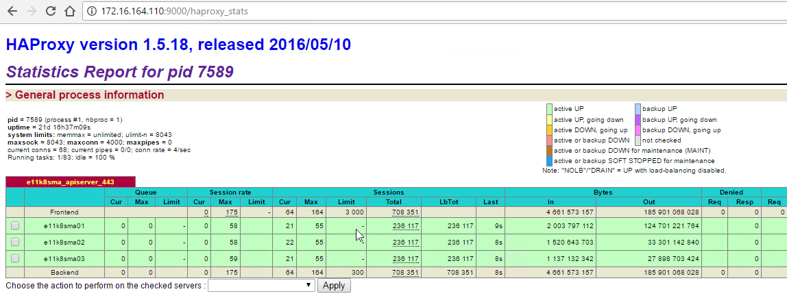

# Kubernetes Tutorials (6)

## How to Install Kubernetes Master Nodes

# Server List 

|   ServerName  |   IP Address  |   vCPU    |   Memory(GB)  |   HDisk(GB)   |   Descriptions |
|:---:|:---:|:---:|:---:|:---:|:---:|
|E11K8SMA01|172.16.164.111|8|32|200|Kubernetes Master Node|
|E11K8SMA02|172.16.164.112|8|32|200|Kubernetes Master Node|
|E11K8SMA03|172.16.164.113|8|32|200|Kubernetes Master Node|

# Step by Step 

## Step 1: Deployment ENV Options

Before start, let's configure and plan for some options which we need in the later Kubernetes installation.

    MASTER_HOST = 172.16.164.110

    ETCD_ENDPOINTS = https://172.16.164.101:2379,https://172.16.164.102:2379,https://172.16.164.103:2379,https://172.16.164.104:2379,https://172.16.164.105:2379

    POD_NETWORK = 10.2.0.0/16

    SERVICE_IP_RANGE = 10.3.0.0/16

    K8S_SERVICE_IP = 10.3.0.1

    DNS_SERVICE_IP = 10.3.0.10

> Replacing `MASTER_HOST = 172.16.164.110` IP address to the VIP (Virtual IP) address of the Kubernetes API Service.

> Replacing `ETCD_ENDPOINTS = ` IP addresses ports list to your own etcd cluster endpoints.

> I recommend to keep rest value as the  default value. You're welcome to modify them if you know what you are doing.

## Step 2: Generate Kubernetes CA certificates

Let's login the CA server as root

|   ServerName  |   IP Address  |   vCPU    |   Memory(GB)  |   HDisk(GB)   |   Descriptions |
|:---:|:---:|:---:|:---:|:---:|:---:|
|E11K8SCA01|172.16.164.99|2|2|20|Certificates Generator & Http File Service|

Create a folder to keep the certificates

```
mkdir ~/k8sssl
cd ~/k8sssl
```

Generate the CA certificate

```
openssl genrsa -out ca-key.pem 2048
openssl req -x509 -new -nodes -key ca-key.pem -days 87600 -out ca.pem -subj "/CN=kube-ca"
```

## Step 3: create openssl.cnf

### openssl.cnf

```
[req]
req_extensions = v3_req
distinguished_name = req_distinguished_name
[req_distinguished_name]
[ v3_req ]
basicConstraints = CA:FALSE
keyUsage = nonRepudiation, digitalSignature, keyEncipherment
subjectAltName = @alt_names
[alt_names]
DNS.1 = kubernetes
DNS.2 = kubernetes.default
DNS.3 = kubernetes.default.svc
DNS.4 = kubernetes.default.svc.cluster.local
IP.1 = 10.3.0.1
IP.2 = 172.16.164.110
IP.3 = 172.16.164.111
IP.4 = 172.16.164.112
IP.5 = 172.16.164.113
```
> You will find out the `IP.1` is the `K8S_SERVICE_IP = 10.3.0.1`

> Replacing the `IP.2` with the haproxy servers VIP address. Also the `MASTER_HOST`.

> Replacing the `IP.3`, `IP.4`, `IP.5` with your three Master nodes server IP addresses.

## Step 4: Generate the API Servers Certificates Key pairs

```
openssl genrsa -out apiserver-key.pem 2048
openssl req -new -key apiserver-key.pem -out apiserver.csr -subj "/CN=kube-apiserver" -config openssl.cnf
openssl x509 -req -in apiserver.csr -CA ca.pem -CAkey ca-key.pem -CAcreateserial -out apiserver.pem -days 3650 -extensions v3_req -extfile openssl.cnf
```

check the results 

```
[root@e11k8sca01 k8sssl]# ls -al
total 32
drwxr-xr-x  2 root root  131 Jun 24 06:14 .
dr-xr-x---. 7 root root 4096 Jun 24 06:14 ..
-rw-r--r--  1 root root 1143 Jun 24 06:14 apiserver.csr
-rw-r--r--  1 root root 1679 Jun 24 06:14 apiserver-key.pem
-rw-r--r--  1 root root 1212 Jun 24 06:14 apiserver.pem
-rw-r--r--  1 root root 1675 Jun 24 06:13 ca-key.pem
-rw-r--r--  1 root root 1090 Jun 24 06:13 ca.pem
-rw-r--r--  1 root root   17 Jun 24 06:14 ca.srl
-rw-r--r--  1 root root  465 Jun 24 06:14 openssl.cnf
```

> Tips:

You can share the `k8sssl` folder as `cfssl` as what we before.

```
chmod o+x /root
chmod o+x /root/k8sssl

ln -s /root/k8sssl /var/www/html
```

Open a browser check

http://{ca-server-ip}/k8sssl to see if all the certificates are there.


## Step 5: Copy the certificates to the Master Nodes.

Login 

|   ServerName  |   IP Address  |   vCPU    |   Memory(GB)  |   HDisk(GB)   |   Descriptions |
|:---:|:---:|:---:|:---:|:---:|:---:|
|E11K8SMA01|172.16.164.111|8|32|200|Kubernetes Master Node|
|E11K8SMA02|172.16.164.112|8|32|200|Kubernetes Master Node|
|E11K8SMA03|172.16.164.113|8|32|200|Kubernetes Master Node|

### Create Create /etc/kubernetes/ssl

```
sudo mkdir -p /etc/kubernetes/ssl
cd /etc/kubernetes/ssl
```

### Download the certificates

```
sudo curl -O http://172.16.164.99/k8sssl/ca.pem
sudo curl -O http://172.16.164.99/k8sssl/apiserver-key.pem
sudo curl -O http://172.16.164.99/k8sssl/apiserver.pem
sudo curl -O http://172.16.164.99/cfssl/newegg-etcd-root-ca.pem
sudo curl -O http://172.16.164.99/cfssl/client.pem
sudo curl -O http://172.16.164.99/cfssl/client-key.pem
```

> Tips:  Check the certificate file size, if there is some files with only arround 200 bytes, there must be something run with the url.

```
core@e11k8sma01 /etc/kubernetes/ssl $ ls -al
total 64
drwxr-xr-x. 2 root root 4096 May 12 15:14 .
drwxr-xr-x. 5 root root 4096 May 12 15:21 ..
-rw-------. 1 root root 1679 May 12 15:10 apiserver-key.pem
-rw-r--r--. 1 root root 1212 May 12 15:10 apiserver.pem
-rw-r--r--. 1 root root 1090 May 12 15:10 ca.pem
-rw-------. 1 root root 1679 May 12 15:14 client-key.pem
-rw-r--r--. 1 root root 1294 May 12 15:13 client.pem
-rw-r--r--. 1 root root 1371 May 12 15:13 newegg-etcd-root-ca.pem
```

## Step 5: Create configuration folders

```
sudo mkdir -p /etc/flannel/
sudo mkdir -p /etc/systemd/system/flanneld.service.d/
sudo mkdir -p /etc/systemd/system/docker.service.d
sudo mkdir -p /etc/kubernetes/cni/
sudo mkdir -p /etc/kubernetes/cni/net.d/
sudo mkdir -p /etc/kubernetes/manifests
```

## Step 6: Flannel Configurations

### /etc/flannel/options.env

```
FLANNELD_IFACE=172.16.164.111
FLANNELD_ETCD_ENDPOINTS=https://172.16.164.101:2379,https://172.16.164.102:2379,https://172.16.164.103:2379,https://172.16.164.104:2379,https://172.16.164.105:2379
ETCD_SSL_DIR=/etc/kubernetes/ssl
FLANNELD_ETCD_CAFILE=/etc/kubernetes/ssl/newegg-etcd-root-ca.pem
FLANNELD_ETCD_CERTFILE=/etc/kubernetes/ssl/client.pem
FLANNELD_ETCD_KEYFILE=/etc/kubernetes/ssl/client-key.pem
```

> Replacing the `FLANNELD_IFACE` with your real ip address of your current master node.

> Replacing `FLANNELD_ETCD_ENDPOINTS` with your etcd cluster endpoints list.

### /etc/systemd/system/flanneld.service.d/40-ExecStartPre-symlink.conf

```
[Service]
ExecStartPre=/usr/bin/ln -sf /etc/flannel/options.env /run/flannel/options.env
```

## Step 7: Docker Configurations

### /etc/systemd/system/docker.service.d/40-flannel.conf

```
[Unit]
Requires=flanneld.service
After=flanneld.service
[Service]
EnvironmentFile=/etc/kubernetes/cni/docker_opts_cni.env
```

### /etc/kubernetes/cni/docker_opts_cni.env

```
DOCKER_OPT_BIP=""
DOCKER_OPT_IPMASQ=""
```

### /etc/kubernetes/cni/net.d/10-flannel.conf

```
{
    "name": "podnet",
    "type": "flannel",
    "delegate": {
        "isDefaultGateway": true
    }
}
```

## Step 7: Kubelet Service

### /etc/systemd/system/kubelet.service

```
[Service]
Environment=KUBELET_IMAGE_TAG=v1.6.3_coreos.0
Environment="RKT_RUN_ARGS=--uuid-file-save=/var/run/kubelet-pod.uuid \
  --volume var-log,kind=host,source=/var/log \
  --mount volume=var-log,target=/var/log \
  --volume dns,kind=host,source=/etc/resolv.conf \
  --mount volume=dns,target=/etc/resolv.conf \
  --volume cni-bin,kind=host,source=/opt/cni/bin \
  --mount volume=cni-bin,target=/opt/cni/bin \
  --volume modprobe,kind=host,source=/usr/sbin/modprobe \
  --mount volume=modprobe,target=/usr/sbin/modprobe \
  --volume lib-modules,kind=host,source=/lib/modules \
  --mount volume=lib-modules,target=/lib/modules \
  --volume iscsiadm,kind=host,source=/usr/sbin/iscsiadm \
  --mount volume=iscsiadm,target=/usr/sbin/iscsiadm"
ExecStartPre=/usr/bin/mkdir -p /etc/kubernetes/manifests
ExecStartPre=/usr/bin/mkdir -p /var/log/containers
ExecStartPre=-/usr/bin/rkt rm --uuid-file=/var/run/kubelet-pod.uuid
ExecStartPre=/usr/bin/mkdir -p /opt/cni/bin
ExecStart=/usr/lib/coreos/kubelet-wrapper \
  --api-servers=http://127.0.0.1:8080 \
  --register-schedulable=false \
  --cni-conf-dir=/etc/kubernetes/cni/net.d \
  --network-plugin=cni \
  --container-runtime=docker \
  --allow-privileged=true \
  --pod-manifest-path=/etc/kubernetes/manifests \
  --hostname-override=172.16.164.111 \
  --cluster_dns=10.3.0.10 \
  --cluster_domain=cluster.local
ExecStop=-/usr/bin/rkt stop --uuid-file=/var/run/kubelet-pod.uuid
Restart=always
RestartSec=10

[Install]
WantedBy=multi-user.target
```

> Replacing `KUBELET_IMAGE_TAG=v1.6.3_coreos.0` with your favor value , for more detail you can check the Link: [https://quay.io/repository/coreos/hyperkube?tab=tags](https://quay.io/repository/coreos/hyperkube?tab=tags)

> The hyperkuber images version has to be the same for all the kubernetes components.

> Replacing the `--hostname-override=172.16.164.111` with your current master node real ip address.

## Step 8: Kubernetes APIServer

### /etc/kubernetes/manifests/kube-apiserver.yaml

```
apiVersion: v1
kind: Pod
metadata:
  name: kube-apiserver
  namespace: kube-system
spec:
  hostNetwork: true
  containers:
  - name: kube-apiserver
    image: quay.io/coreos/hyperkube:v1.6.3_coreos.0
    command:
    - /hyperkube
    - apiserver
    - --bind-address=0.0.0.0
    - --etcd-servers=https://172.16.164.101:2379,https://172.16.164.102:2379,https://172.16.164.103:2379,https://172.16.164.104:2379,https://172.16.164.105:2379
    - --allow-privileged=true
    - --service-cluster-ip-range=10.3.0.0/16
    - --secure-port=443
    - --advertise-address=172.16.164.110
    - --admission-control=NamespaceLifecycle,LimitRanger,ServiceAccount,DefaultStorageClass,ResourceQuota
    - --tls-cert-file=/etc/kubernetes/ssl/apiserver.pem
    - --tls-private-key-file=/etc/kubernetes/ssl/apiserver-key.pem
    - --client-ca-file=/etc/kubernetes/ssl/ca.pem
    - --service-account-key-file=/etc/kubernetes/ssl/apiserver-key.pem
    - --runtime-config=extensions/v1beta1/networkpolicies=true
    - --anonymous-auth=false
    - --etcd-cafile=/etc/kubernetes/ssl/newegg-etcd-root-ca.pem
    - --etcd-certfile=/etc/kubernetes/ssl/client.pem
    - --etcd-keyfile=/etc/kubernetes/ssl/client-key.pem
    - --authorization-mode=RBAC
    - --storage-backend=etcd3
    - --audit-log-maxage=7
    - --audit-log-maxbackup=7
    - --audit-log-maxbackup=100
    - --audit-log-path=/var/log/audit/kube-audit.log
    livenessProbe:
      httpGet:
        host: 127.0.0.1
        port: 8080
        path: /healthz
      initialDelaySeconds: 15
      timeoutSeconds: 15
    ports:
    - containerPort: 443
      hostPort: 443
      name: https
    - containerPort: 8080
      hostPort: 8080
      name: local
    volumeMounts:
    - mountPath: /etc/kubernetes/ssl
      name: ssl-certs-kubernetes
      readOnly: true
    - mountPath: /etc/ssl/certs
      name: ssl-certs-host
      readOnly: true
    - mountPath: /var/log/audit
      name: kube-audit
  volumes:
  - hostPath:
      path: /etc/kubernetes/ssl
    name: ssl-certs-kubernetes
  - hostPath:
      path: /usr/share/ca-certificates
    name: ssl-certs-host
  - hostPath:
      path: /var/log/audit
    name: kube-audit
```

> Replacing `image: quay.io/coreos/hyperkube:v1.6.3_coreos.0` with your kubernetes version, must be same with all your kubernetes components settings.

> Replacing `- --etcd-servers=` flag with your own etcd cluster server list.

> Replacing `- --advertise-address=172.16.164.110` with your APIServers VIP address.

## Step 8: Kube Proxy
### /etc/kubernetes/manifests/kube-proxy.yaml

```
apiVersion: v1
kind: Pod
metadata:
  name: kube-proxy
  namespace: kube-system
spec:
  hostNetwork: true
  containers:
  - name: kube-proxy
    image: quay.io/coreos/hyperkube:v1.6.3_coreos.0
    command:
    - /hyperkube
    - proxy
    - --master=http://127.0.0.1:8080
    securityContext:
      privileged: true
    volumeMounts:
    - mountPath: /etc/ssl/certs
      name: ssl-certs-host
      readOnly: true
  volumes:
  - hostPath:
      path: /usr/share/ca-certificates
    name: ssl-certs-host
```

> Replacing `image: quay.io/coreos/hyperkube:v1.6.3_coreos.0` with your kubernetes version, must be same with all your kubernetes components settings.

## Step 9 : Kube Controller Manager

### /etc/kubernetes/manifests/kube-controller-manager.yaml

```
apiVersion: v1
kind: Pod
metadata:
  name: kube-controller-manager
  namespace: kube-system
spec:
  hostNetwork: true
  containers:
  - name: kube-controller-manager
    image: quay.io/coreos/hyperkube:v1.6.3_coreos.0
    command:
    - /hyperkube
    - controller-manager
    - --master=http://127.0.0.1:8080
    - --leader-elect=true
    - --service-account-private-key-file=/etc/kubernetes/ssl/apiserver-key.pem
    - --root-ca-file=/etc/kubernetes/ssl/ca.pem
    resources:
      requests:
        cpu: 200m
    livenessProbe:
      httpGet:
        host: 127.0.0.1
        path: /healthz
        port: 10252
      initialDelaySeconds: 15
      timeoutSeconds: 15
    volumeMounts:
    - mountPath: /etc/kubernetes/ssl
      name: ssl-certs-kubernetes
      readOnly: true
    - mountPath: /etc/ssl/certs
      name: ssl-certs-host
      readOnly: true
  volumes:
  - hostPath:
      path: /etc/kubernetes/ssl
    name: ssl-certs-kubernetes
  - hostPath:
      path: /usr/share/ca-certificates
    name: ssl-certs-host
```

> Replacing `image: quay.io/coreos/hyperkube:v1.6.3_coreos.0` with your kubernetes version, must be same with all your kubernetes components settings.

## Step 10: Kube Scheduler

### /etc/kubernetes/manifests/kube-scheduler.yaml

```
apiVersion: v1
kind: Pod
metadata:
  name: kube-scheduler
  namespace: kube-system
spec:
  hostNetwork: true
  containers:
  - name: kube-scheduler
    image: quay.io/coreos/hyperkube:v1.6.3_coreos.0
    command:
    - /hyperkube
    - scheduler
    - --master=http://127.0.0.1:8080
    - --leader-elect=true
    resources:
      requests:
        cpu: 100m
    livenessProbe:
      httpGet:
        host: 127.0.0.1
        path: /healthz
        port: 10251
      initialDelaySeconds: 15
      timeoutSeconds: 15
```

> Replacing `image: quay.io/coreos/hyperkube:v1.6.3_coreos.0` with your kubernetes version, must be same with all your kubernetes components settings.

## Step 11: Start Services

### Daemon Reload

```
sudo systemctl daemon-reload
```

> Tips: Everytime you change the configuration under the `/etc/systemd`, you have to run `systemctl daemon-reload`.

### Create POD_NETWORK on etcd

```
curl --cacert /etc/kubernetes/ssl/newegg-etcd-root-ca.pem --cert /etc/kubernetes/ssl/client.pem --key /etc/kubernetes/ssl/client-key.pem -X PUT -d "value={\"Network\":\"10.2.0.0/16\",\"Backend\":{\"Type\":\"vxlan\"}}" "https://172.16.164.101:2379/v2/keys/coreos.com/network/config"
```

> Replacing `https://172.16.164.101:2379` with one url (http://ip:port) from $ETCD_ENDPOINTS.

### Start the flanneld service

```
sudo systemctl enable flanneld --now
```

### Start the kubelet service

```
sudo systemctl enable kubelet --now
```

> Tips: If something wrong with the services , you can use `sudo journalctl -b -fu {Service.Name}` to check the service log. Replace the {Service.Name} with "flanneld" or "kubelet".

## Step 12: Basic Check

Check command 1: 

```
core@e11k8sma01 ~ $ curl http://127.0.0.1:8080/version
```

Output:

```
{
  "major": "1",
  "minor": "6",
  "gitVersion": "v1.6.3+coreos.0",
  "gitCommit": "8996efde382d88f0baef1f015ae801488fcad8c4",
  "gitTreeState": "clean",
  "buildDate": "2017-05-19T21:11:20Z",
  "goVersion": "go1.7.5",
  "compiler": "gc",
  "platform": "linux/amd64"
}
```

Check command 2: 

```
core@e11k8sma01 ~ $ curl -s localhost:10255/pods | jq -r '.items[].metadata.name'
```

Output:

```
kube-controller-manager-172.16.164.111
kube-proxy-172.16.164.111
kube-scheduler-172.16.164.111
calico-node-7p0gn
alert-horse-prometheus-node-exporter-wnld9
kube-apiserver-172.16.164.111
```

## Step 13: Repeat all above steps on the other two nodes 

Now you shall also check the haproxy status and see all green.

 