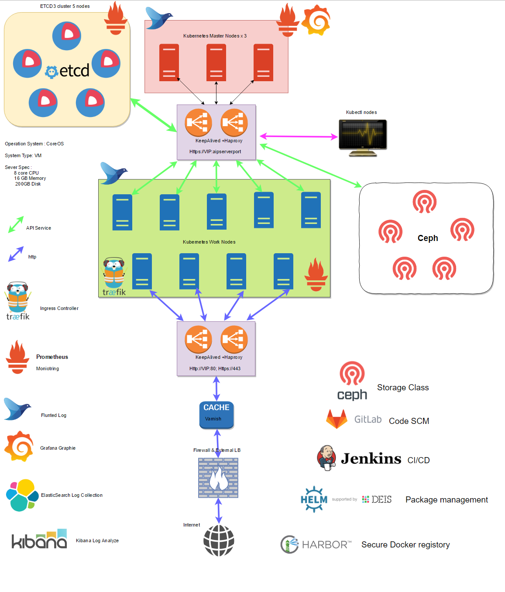

# Kubernetes-Tutorials

# Network Range

*   Node IP :   172.16.164.0/24

*   POD IP:     10.2.0.0/16

*   Cluster IP: 10.3.0.0/16

# Server List

|   ServerName  |   IP Address  |   vCPU    |   Memory(GB)  |   HDisk(GB)   |   Descriptions |
|:---:|:---:|:---:|:---:|:---:|:---:|
|E11K8SCA01|172.16.164.99|2|2|20|Certificates Generator & Http File Service|
|E11K8SETCD01|172.16.164.101|8|16|100|ETCD Cluster(Kubernetes Key-Value DataBase)|
|E11K8SETCD02|172.16.164.102|8|16|100|ETCD Cluster(Kubernetes Key-Value DataBase)|
|E11K8SETCD03|172.16.164.103|8|16|100|ETCD Cluster(Kubernetes Key-Value DataBase)|
|E11K8SETCD04|172.16.164.104|8|16|100|ETCD Cluster(Kubernetes Key-Value DataBase)|
|E11K8SETCD05|172.16.164.105|8|16|100|ETCD Cluster(Kubernetes Key-Value DataBase)|
|E11K8SCTL01|172.16.164.107|4|4|40|Kubectl & Helm |
|E11K8SHAPX01|172.16.164.108|4|4|60|Haproxy & Keepalived (VIP: 172.16.164.110)|
|E11K8SHAPX02|172.16.164.109|4|4|60|Haproxy & Keepalived (VIP: 172.16.164.110)|
|E11K8SMA01|172.16.164.111|8|32|200|Kubernetes Master Node|
|E11K8SMA02|172.16.164.112|8|32|200|Kubernetes Master Node|
|E11K8SMA03|172.16.164.113|8|32|200|Kubernetes Master Node|
|E11K8SMA01|172.16.164.121|8|32|200|Kubernetes Worker Node|
|E11K8SMA02|172.16.164.112|8|32|200|Kubernetes Worker Node|
|...|...|...|...|...|...|
|E11K8SMA27|172.16.164.147|8|32|200|Kubernetes Worker Node|

# Kubernetes_Architecture

