## Kubernetes Tutorials (1)

# How to install CoreOS Container Linux in the BareMetal/VM

## What is CoreOS Container Linux and Why
A lightweight Linux operating system designed for clustered deployments providing automation, security, and scalability for most critical applications.


So basically except some core part of the Linux distribution, like the **kernel**, **systemd**, **sshd**, **docker**, **rkt** those which will be pre-installed in the CoreOS container linux, the others app all will be deployed as a container , even **ping**.

- First Container optimized OS.
- Linux based and based on concepts from ChromeOS
- OS is Security focused.
- Auto Update OS with A/B partition
- OS is Open Source. Along with OS, CoreOS has following components:
  - Systemd as Init system
  - Etcd as distributed database
  - Flannel for Container networking 
  - Docker, Rkt for Containers
- CoreOS integrates well with Kubernetes
___
## Environment Preparation 

### Requirement

    -   VM on ESXi
    -   CentOS 7 live CD
    -   Internet Access

[Download CentOS 7 GNOME LiveCD From here](https://buildlogs.centos.org/centos/7/isos/x86_64/CentOS-7-livecd-GNOME-x86_64.iso)

### Prepare the VM on ESXi

Select VM specs, we will using below spec just for example:
    
    - CPU: 4 core vCPU
    - Memory: 8 GB Memory
    - Disk: 40 GB HDD

<!---
For VMWare announced in May 2016 that the Legacy C# Client (aka thick client, desktop client, or vSphere Client) will no longer be available with the vSphere 6.5 release. For more information, see [Goodbye vSphere Client for Windows (C#) – Hello HTML5](https://blogs.vmware.com/vsphere/2016/05/goodbye-vsphere-client-for-windows-c-hello-html5.html).

## ***Attention: If you know how to install the VM on the ESXi 6.5, please skip these steps***

**For the Operation is Much  Much different with the vSphere we used before, I'd like to spend some words to explain how to using the ESXi 6.5 web client** 

Let's Open the vSphere Web Client (Using firefox get the better experience than the Chrome ).

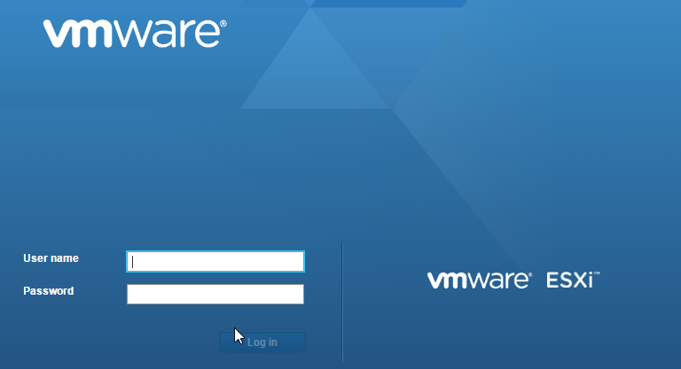

### Check the host resource 

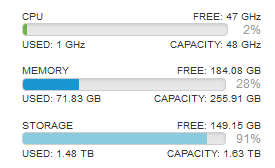

There are already 9 VMs running on the host now.

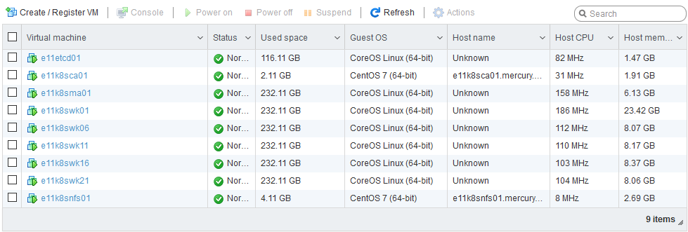

### Create a New VM

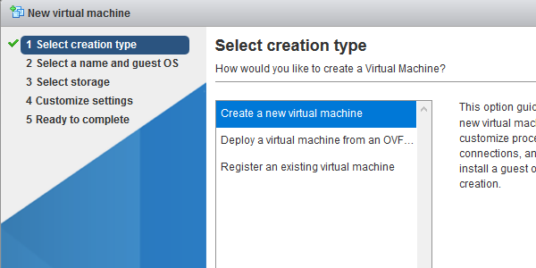

VMWare ESXi 6.5 official support the CoreOS Linux Guest OS Version.

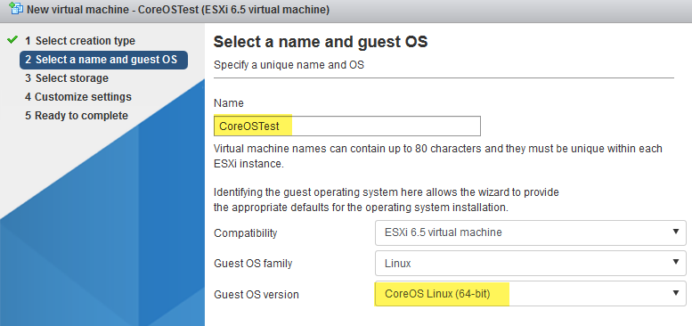


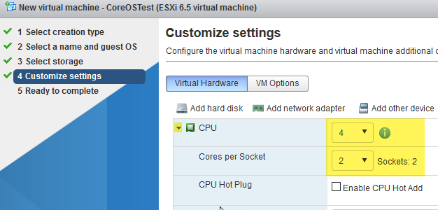


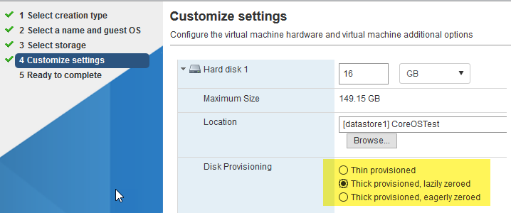


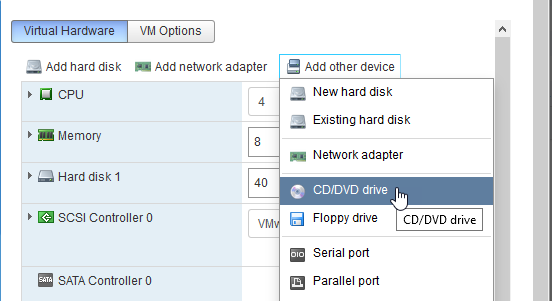


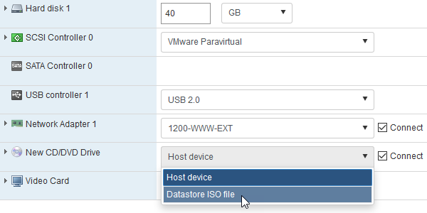


### Result

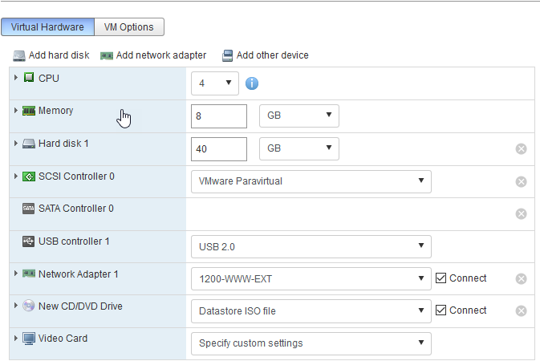

### start the VM

Now you have a running VM with [CentOS 7 liveCD GNOME](https://buildlogs.centos.org/centos/7/isos/x86_64)

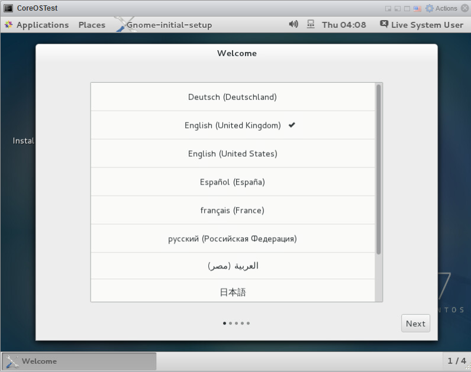

--->
---
# Step by Step on install CoreOS

### Referrence
[CoreOS Installing to disk](https://coreos.com/os/docs/latest/installing-to-disk.html)

    - Step 1: prepare the SSH-key for ssh login CoreOS
    - Step 2: Create the Cloud-init config file "cloud-config.yaml"
    - Step 3: Download the "coreos-install" install script
    - Step 4: Start VM/Server with CentOS 7 GNOME , config the IP address to make sure it can access the internet
    - Step 5: wget "coreos-install" and "cloud-config.yaml"
    - Step 6: ./coreos-install -d /dev/sda -C stable -c cloud-config.yaml 
    - Step 7: reboot 
    - Step 8: login with SSH private key 


## Step 1: Prepare the SSH key
Using below command to generate the ssh key, you can change the email address after the "-C" argument to the maintainer's email address. We will use these key pair to login our CoreOS system.

```bash
ssh-keygen -t rsa -b 2048 -C "jude.x.zhu@newegg.com"
```
Using the passphrase to double secure the ssh login.  

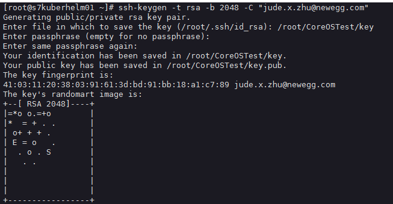

The command will generate two files(These files are only example, will not be using in the real environment ):

    - key:      This is the private key, which you need to keep safe to using login the linux server
    - key.pub:  This is the public key, which need to copy to the CoreOS Linux Server 

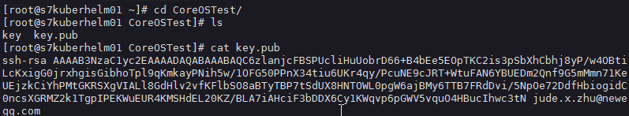

## Step 2: Create Cloud-init Config File


### Cloud-init Config File

[Cloud config init file examples](http://cloudinit.readthedocs.io/en/latest/topics/examples.html)

cloud-config.yaml

```yaml
#cloud-config
#
##hostname
hostname: "e11coreostest01.mercury.corp"

# include one or more SSH public keys
ssh_authorized_keys:
  - ssh-rsa AAAAB3NzaC1yc2EAAAA...7Wy9GGHYcZi1pICKS9IR jude.x.zhu@newegg.com #Paste your public rsa-key here.
# Network
coreos:
  units:
    - name: 00-internal.network
      runtime: true
      content: |
        [Match]
        Name=ens192

        [Network]
        DNS=172.16.72.1
        DNS=172.16.72.2
        Address=172.16.164.98/24
        Gateway=172.16.164.240

        [Route]
        Gateway=172.16.164.1
        Destination=172.16.0.0/12

        [Route]
        Gateway=172.16.164.1
        Destination=10.0.0.0/8
    - name: settimezone.service
      command: start
      content: |
        [Unit]
        Description=Set the time zone

        [Service]
        ExecStart=/usr/bin/timedatectl set-timezone America/Los_Angeles
        RemainAfterExit=yes
        Type=oneshot
    - name: update-engine.service
      mask: true
    - name: locksmithd.service
      mask: true
write_files:
  - path: /etc/systemd/timesyncd.conf
    content: |
      [Time]
      NTP=10.1.37.52 10.1.39.81 10.1.39.82
```
___

Let me explain it part by part.


>The Cloud-init config file must start with `#cloud-config`

```yaml
#cloud-config
```

>Using this to set the hostname of the Container Linux

```yaml
##hostname
hostname: "e11coreostest01.mercury.corp"
```

>Here to set the SSH-key for the Container Linux for the default user *"core"*.

```yaml
# include one or more SSH public keys
ssh_authorized_keys:
  - ssh-rsa AAAAB3NzaC1yc2EAAAA...7Wy9GGHYcZi1pICKS9IR jude.x.zhu@newegg.com #Paste your public rsa-key here.
```

>You might setup a special user with SSH-key, *for example*: 

```yaml
users:
  - name: demo
    groups: sudo
    shell: /bin/bash
    sudo: ['ALL=(ALL) NOPASSWD:ALL']
    ssh-authorized-keys:
      - ssh-rsa AAAAB3NzaC1yc2EAAAADAQABAAABAQDf0q4PyG0doiBQYV7OlOxbRjle026hJPBWD+eKHWuVXIpAiQlSElEBqQn0pOqNJZ3IBCvSLnrdZTUph4czNC4885AArS9NkyM7lK27Oo8RV888jWc8hsx4CD2uNfkuHL+NI5xPB/QT3Um2Zi7GRkIwIgNPN5uqUtXvjgA+i1CS0Ku4ld8vndXvr504jV9BMQoZrXEST3YlriOb8Wf7hYqphVMpF3b+8df96Pxsj0+iZqayS9wFcL8ITPApHi0yVwS8TjxEtI3FDpCbf7Y/DmTGOv49+AWBkFhS2ZwwGTX65L61PDlTSAzL+rPFmHaQBHnsli8U9N6E4XHDEOjbSMRX user@example.com
      - ssh-rsa AAAAB3NzaC1yc2EAAAADAQABAAABAQDcthLR0qW6y1eWtlmgUE/DveL4XCaqK6PQlWzi445v6vgh7emU4R5DmAsz+plWooJL40dDLCwBt9kEcO/vYzKY9DdHnX8dveMTJNU/OJAaoB1fV6ePvTOdQ6F3SlF2uq77xYTOqBiWjqF+KMDeB+dQ+eGyhuI/z/aROFP6pdkRyEikO9YkVMPyomHKFob+ZKPI4t7TwUi7x1rZB1GsKgRoFkkYu7gvGak3jEWazsZEeRxCgHgAV7TDm05VAWCrnX/+RzsQ/1DecwSzsP06DGFWZYjxzthhGTvH/W5+KFyMvyA+tZV4i1XM+CIv/Ma/xahwqzQkIaKUwsldPPu00jRN user@desktop
```

>This part is about the network setting

```yaml
# Network
coreos:
  units:
    - name: 00-internal.network
      runtime: true
      content: |
        [Match]
        Name=ens192

        [Network]
        DNS=172.16.72.1
        DNS=172.16.72.2
        Address=172.16.164.98/24
        Gateway=172.16.164.240

        [Route]
        Gateway=172.16.164.1
        Destination=172.16.0.0/12

        [Route]
        Gateway=172.16.164.1
        Destination=10.0.0.0/8
```

>Match the NIC card name you want the IP on bind with.

```yaml
        [Match]
        Name=ens192
```

>DNS, IP Addr, Gateway 

```yaml
        [Network]
        DNS=172.16.72.1
        DNS=172.16.72.2
        Address=172.16.164.98/24
        Gateway=172.16.164.240

```

>Static Route Setting

```yaml
        [Route]
        Gateway=172.16.164.1
        Destination=172.16.0.0/12

        [Route]
        Gateway=172.16.164.1
        Destination=10.0.0.0/8
```

>Set the Time Zone and enable the NTP service

```yaml
    - name: settimezone.service
      command: start
      content: |
        [Unit]
        Description=Set the time zone

        [Service]
        ExecStart=/usr/bin/timedatectl set-timezone America/Los_Angeles
        RemainAfterExit=yes
        Type=oneshot
```
>Disable the Automatic update and Automatic reboot Services

```yaml
    - name: update-engine.service
      mask: true
    - name: locksmithd.service
      mask: true
```

>Create a File to list the NTP servers

```yaml
write_files:
  - path: /etc/systemd/timesyncd.conf
    content: |
      [Time]
      NTP=10.1.37.52 10.1.39.81 10.1.39.82
```

>Save your coreos-install bash script and cloud-config.yaml cloud-init config file to a http file server. *(you can easily build one with Apache httpd)*

You can download an example from here: [cloud-config.yaml](http://172.16.164.99/coreos/installation/cloud-config.yaml)

___

## Step 3: Download the coreos-install script

### Install Script

There is a simple installer that will destroy everything on the given target disk and install Container Linux. Essentially it downloads an image, verifies it with gpg, and then copies it bit for bit to disk. An installation requires at least 8 GB of usable space on the device.

Download  the self install script from here: 
[coreos-install](https://raw.githubusercontent.com/coreos/init/master/bin/coreos-install)

For reference here are the rest of the coreos-install options:

    -   -d DEVICE   Install Container Linux to the given device.
    -   -V VERSION  Version to install (e.g. current)
    -   -B BOARD    Container Linux board to use
    -   -C CHANNEL  Release channel to use (e.g. beta)
    -   -o OEM      OEM type to install (e.g. ami)
    -   -c CLOUD    Insert a cloud-init config to be executed on boot.
    -   -i IGNITION Insert an Ignition config to be executed on boot.
    -   -t TMPDIR   Temporary location with enough space to download images.
    -   -v          Super verbose, for debugging.
    -   -b BASEURL  URL to the image mirror (overrides BOARD)
    -   -n          Copy generated network units to the root partition.

We will using the **-C**, **-d**, **-c** options. 


___
## Step 4: Start the VM with CentOS 7 GNOME LiveCD

setup the network so the VM boot with LiveCD can access internet

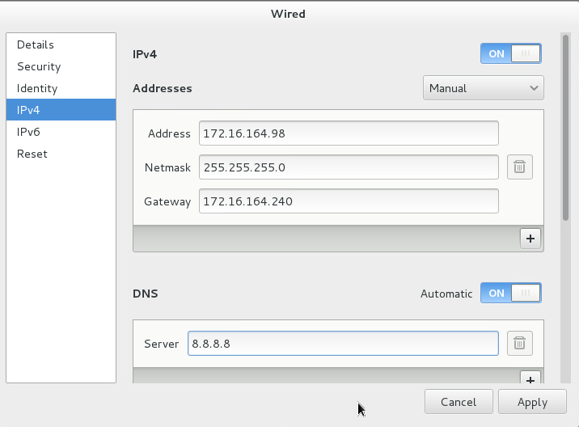

## *Important: Make sure you can access the internet via "ping 8.8.8.8"*

Modify the cloud-config.yaml as you want

  - change the Hostname
  - change the IP address
  - change the DNS
  - etc.

## Step 5: wget "coreos-install" and "cloud-config.yaml"

 chmod +x to coreos-install and run install command as below :

## Step 6: ./coreos-install -d /dev/sda -C stable -c cloud-config.yaml 

```bash
./coreos-install -d /dev/sda -C stable -c cloud-config.yaml 
``` 

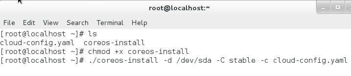


It will download the newest version of CoreOS from the Channel you set, here is the stable channel, install to the Block device which here is /dev/sda.

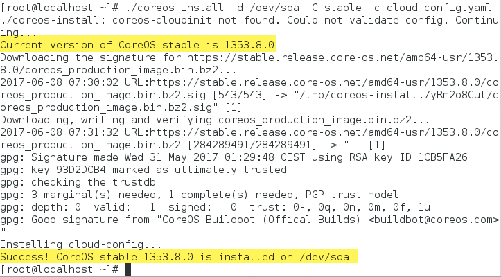

## Step 7: reboot the server 

```
reboot
```

Now our CoreOS has been installed successfully and ready to login

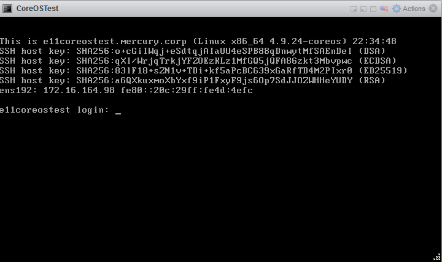

___

## Step 8: Login

### Using Command

```
ssh -i key core@your.server.ip.address
```

### Setting up the X-shell profile

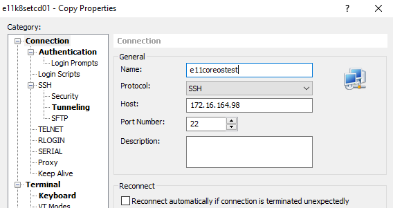
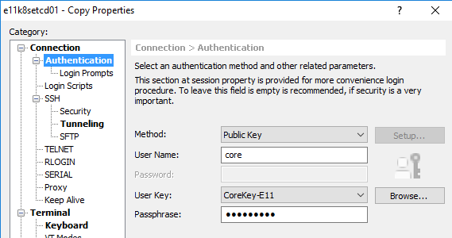

Now we can login the server and check 

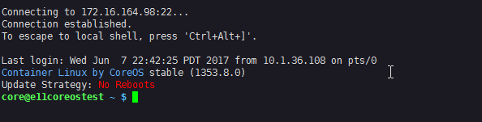

And find out the Docker and rkt engine is running on the server 

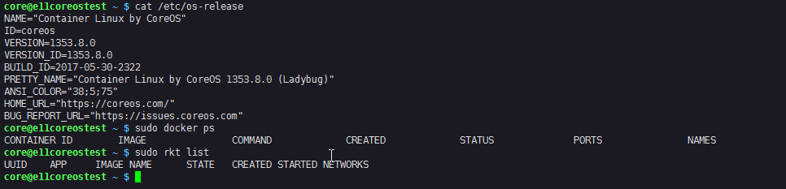