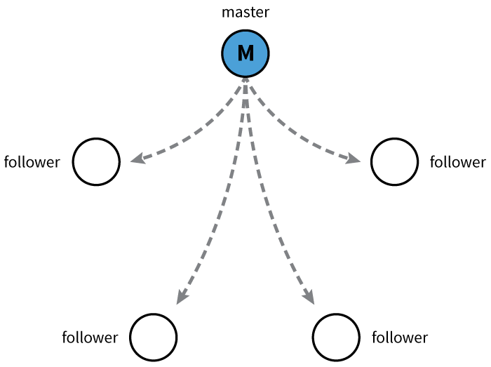
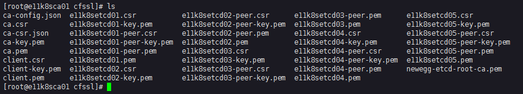

## Kubernetes Tutorials (2)

# How to generate certificates for ETCD 

## What is etcd

etcd is a distributed key value store that provides a reliable way to store data across a cluster of machines. It’s open-source and available on GitHub. etcd gracefully handles leader elections during network partitions and will tolerate machine failure, including the leader.


The replication between the leader and followers.



## Why we use etcd

For etcd is the default backend for service discovery and stores cluster state and configuration of kubernetes. It's kubernetes's database.

## System requirement 

Since etcd writes data to disk, ***SSD is highly recommended***.  At CoreOS, an etcd cluster is usually deployed on dedicated CoreOS Container Linux machines with ***dual-core processors, 2GB of RAM, and 80GB of SSD at the very least.***

### Small cluster

A small cluster serves fewer than 100 clients, fewer than 200 of requests per second, and stores no more than 100MB of data.

Example application workload: ***A 50-node Kubernetes cluster***:

| PROVIDER      | TYPE                       | VCPUS  | MEMORY (GB)  | MAX CONCURRENT IOPS  | DISK BANDWIDTH (MB/S) |
| ------------- |:--------------------------:|:------:|:------------:|:--------------------:|:---------------------:|
| AWS           | m4.large                   | 2      | 8            | 	3600                | 56.25                 |
| GCE           | n1-standard-1 + 50GB PD SSD| 2      | 7.5          | 	1500                | 25                    |


### Medium cluster

A medium cluster serves fewer than 500 clients, fewer than 1,000 of requests per second, and stores no more than 500MB of data.

Example application workload: ***A 250-node Kubernetes cluster***

| PROVIDER      | TYPE                        | VCPUS  | MEMORY (GB)  | MAX CONCURRENT IOPS  | DISK BANDWIDTH (MB/S) |
| ------------- |:---------------------------:|:------:|:------------:|:--------------------:|:---------------------:|
| AWS           | m4.xlarge                   | 4      | 16           | 6000                 | 93.75                 |
| GCE           | n1-standard-4 + 150GB PD SSD| 4      | 15           | 4500                 | 75                    |

### Large cluster

A large cluster serves fewer than 1,500 clients, fewer than 10,000 of requests per second, and stores no more than 1GB of data.

Example application workload: ***A 1,000-node Kubernetes cluster***

| PROVIDER      | TYPE                        | VCPUS  | MEMORY (GB)  | MAX CONCURRENT IOPS  | DISK BANDWIDTH (MB/S) |
| ------------- |:---------------------------:|:------:|:------------:|:--------------------:|:---------------------:|
| AWS           | m4.2xlarge                  | 8      | 32           | 8000                 | 125                   |
| GCE           | n1-standard-8 + 250GB PD SSD| 8      | 30           | 7500                 | 125                   |

## Server Spec

For our kubernetes scale , I chose the Medium Cluster

|     VCPU      |     MEMORY(GB)      |     DISK(GB)      |
|:-------------:|:-------------------:|:-----------------:|  
|      8        |        16           |        100        |

## Failure Tolerance

An etcd cluster operates so long as a member quorum can be established. If quorum is lost through transient network failures (e.g., partitions), etcd automatically and safely resumes once the network recovers and restores quorum; Raft enforces cluster consistency.

It is recommended to have an odd number of members in a cluster. An odd-size cluster tolerates the same number of failures as an even-size cluster but with fewer nodes.

| CLUSTER SIZE  | MAJORITY   | FAILURE TOLERANCE |
|:-------------:|:----------:|:-----------------:|
|       1       |      1     |         0         |
|       2       |      2     |         0         |
|       3       |      2     |         1         |
|       4       |      3     |         1         |  
|    ***5***    |   ***3***  |      ***2***      |
|       6       |      4     |         2         |
|       7       |      4     |         3         |
|       8       |      5     |         3         |
|       9       |      5     |         4         |

We will choose the ClusterSize as 5 nodes and the Failure tolerance will be 2 nodes. If 3 nodes failed, it will turn to ReadOnly mode. Although all the kubernetes existed pods and services are still running , but no more operations can be executed. 

## Security model

[Reference](https://coreos.com/etcd/docs/latest/op-guide/security.html) 

etcd supports automatic TLS as well as authentication through client certificates for both clients to server as well as peer (server to server / cluster) communication.

To get up and running, first have a CA certificate and a signed key pair for one member. It is recommended to create and sign a new key pair for every member in a cluster.

# Step by Step

    -   Step 1: Download and setup cfssl
    -   Step 2: Using cfssl generate the Configure CA options
    -   Step 3: Generate CA certificate
    -   Step 4: Generate server certificate
    -   Step 5: Generate peer certificate
    -   Step 6: Generate client certificate

## Step 1: Download and setup cfssl

## [Download cfssl from here](https://github.com/cloudflare/cfssl)

We will use CFSSL to generate the certificate for our etcd cluster 

Login to a Linux system and download the cfssl()

```bash
mkdir ~/bin
curl -s -L -o ~/bin/cfssl https://pkg.cfssl.org/R1.2/cfssl_linux-amd64
curl -s -L -o ~/bin/cfssljson https://pkg.cfssl.org/R1.2/cfssljson_linux-amd64
chmod +x ~/bin/{cfssl,cfssljson}
export PATH=$PATH:~/bin
```   

The script first create a folder "bin" under your current account home folder. Then use curl to download the cfssl and cfssljson from the *"pkg.cfssl.org"*. Make them executable. Add "~/bin" to the system path env

Then, let's create a folder for the certificates 

## Step 2: Using cfssl generate the Configure CA options

```bash
mkdir ~/cfssl
cd ~/cfssl
cfssl print-defaults config > ca-config.json
cfssl print-defaults csr > ca-csr.json
``` 

the cfssl script will generate the ca-config and ca-csr file for later CA certificate generation, you can check and modify these files to fit your enterprise need and requirements.

default ca-config.json

```json
{
    "signing": {
        "default": {
            "expiry": "168h"
        },
        "profiles": {
            "www": {
                "expiry": "8760h",
                "usages": [
                    "signing",
                    "key encipherment",
                    "server auth"
                ]
            },
            "client": {
                "expiry": "8760h",
                "usages": [
                    "signing",
                    "key encipherment",
                    "client auth"
                ]
            }
        }
    }
}
```

default ca-csr.json

```json
{
    "CN": "example.net",
    "hosts": [
        "example.net",
        "www.example.net"
    ],
    "key": {
        "algo": "ecdsa",
        "size": 256
    },
    "names": [
        {
            "C": "US",
            "L": "CA",
            "ST": "San Francisco"
        }
    ]
}

```


Let's modify the ca-config and ca-csr 

Modified ca-config.json

```json
{
    "signing": {
        "default": {
            "expiry": "87600h"
        },
        "profiles": {
            "server": {
                "expiry": "87600h",
                "usages": [
                    "signing",
                    "key encipherment",
                    "server auth"
                ]
            },
            "client": {
                "expiry": "87600h",
                "usages": [
                    "signing",
                    "key encipherment",
                    "client auth"
                ]
            },
            "peer": {
                "expiry": "87600h",
                "usages": [
                    "signing",
                    "key encipherment",
                    "server auth",
                    "client auth"
                ]
            }
        }
    }
}
``` 

Modified ca-csr.json

```json
{
    "CN": "Newegg ETCD",
    "key": {
        "algo": "rsa",
        "size": 2048
    },
    "names": [
        {
            "C": "US",
            "L": "CA",
            "O": "NEWEGG INC.",
            "ST": "Los Angeles",
            "OU": "E11"
        }
    ]
}
```

Basically we can have three profiles "server", "client" and "peer" which have different usages you can tell from the ***Modified ca-config.json***.

The expiry has been set to "***87600h***", which is 10 years.

And the key is using rsa with 2048 size.


## Step 3: Generate CA certificate

Use below command to generate the ***ca.csr***, ***ca-key.pem*** and the ***ca.pem***.

```bash
fssl gencert -initca ca-csr.json | cfssljson -bare ca -
```


We have 5 nodes which are e11k8setcd01~05, for each node we will create the server profile type certificates and the peer profile type certificates.

***For example***
    
    -   name:       e11k8setcd01
    -   fqdn:       e11k8setcd01.mercury.corp
    -   ip addr:    172.16.164.101

## Step 4: Generate Server certificate

```bash
echo '{"CN":"e11k8setcd01","hosts":[""],"key":{"algo":"rsa","size":2048}}' | cfssl gencert -ca=ca.pem -ca-key=ca-key.pem -config=ca-config.json -profile=server -hostname="172.16.164.101,e11k8setcd01.mercury.corp,e11k8setcd01.local,e11k8setcd01" - | cfssljson -bare e11k8setcd01
``` 

## Step 5: Generate Peer certificate

```bash
echo '{"CN":"e11k8setcd01","hosts":[""],"key":{"algo":"rsa","size":2048}}' | cfssl gencert -ca=ca.pem -ca-key=ca-key.pem -config=ca-config.json -profile=peer -hostname="172.16.164.101,e11k8setcd01.mercury.corp,e11k8setcd01.local,e11k8setcd01" - | cfssljson -bare e11k8setcd01-peer
```

## Step 6: Generate Client certificate

Finally, let's generate the client certs for all the client need to connect to the etcd cluster

```bash
echo '{"CN":"client","hosts":[""],"key":{"algo":"rsa","size":2048}}' | cfssl gencert -ca=ca.pem -ca-key=ca-key.pem -config=ca-config.json -profile=client - | cfssljson -bare client
```
___

## Result

For 5 nodes , here is all the certs you will have to use eventually. And we will use them later.



>***Tips***
    
-   To separate the ca certificate from the etcd cluster and Kuberntes cluster (*They will all need to generate the ca cert files.*) You can see I've copy the CA cert file to a new "newegg-etcd-root-ca.pem".

-   Put those files or the whole folder into the http file server, so you can easily use the "*curl*" or "*wget*"  command download it to the CoreOS linux servers later.

We will talk about the etcd cluster installation later.